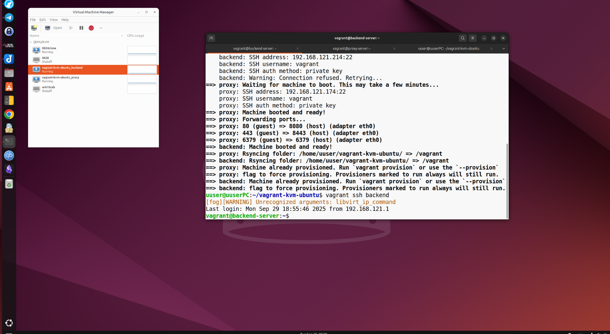
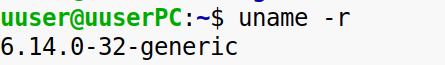
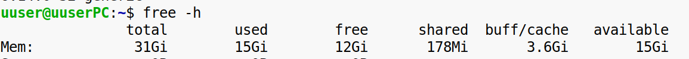
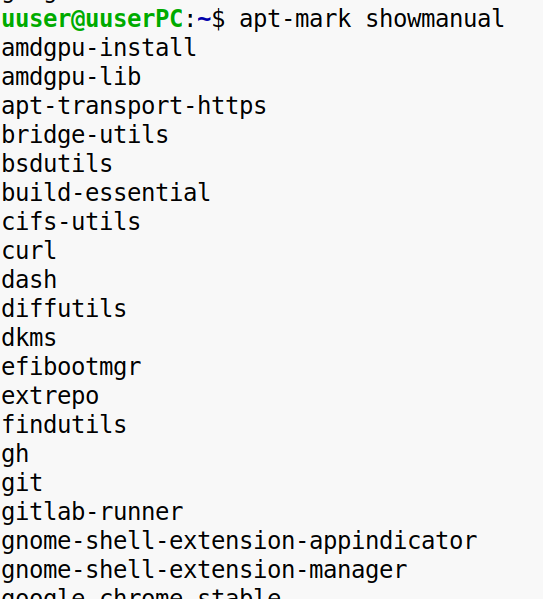
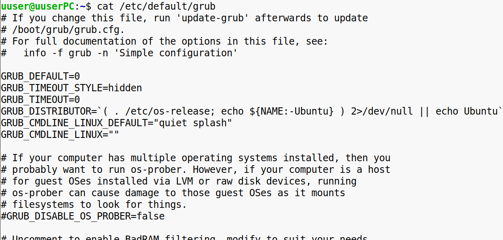
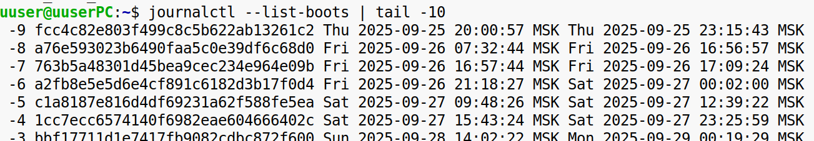
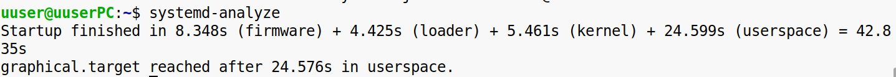

**Задание 1**  
**Установка и настройка системы**

Требования

1\. Установить дистрибутив Ubuntu Desktop.  
2\. Настроить:  
\-Сеть (проверить подключение к интернету).  
\-Общие папки с локальной системой (например, через Samba или VirtualBox Shared Folders).  
3\. Обновить систему и установить доступные обновления.  
4\. Сгенерировать SSH-ключ и подключиться к виртуальной машине через SSH с локального ПК.  

\*\*Задание 2  
\*\***Изучение характеристик системы**

Требования

Используя команды в терминале определить и записать:

1\. Версию ядра.  

2\. Количество доступной и используемой памяти.  

3\. Список предустановленных пакетов.  

4\. Тип загрузчика и его конфигурацию (GRUB, EFI или другой).  

5\. Лог последних загрузок системы.  

6\. Процесса загрузки системы (с описанием этапов).  
