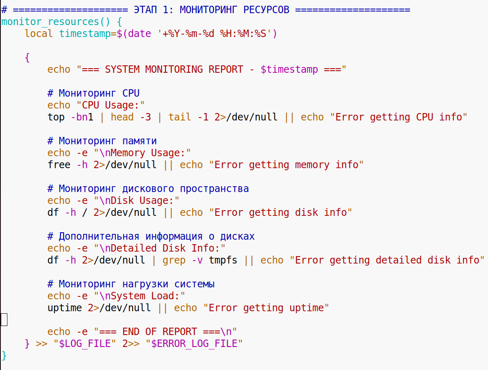
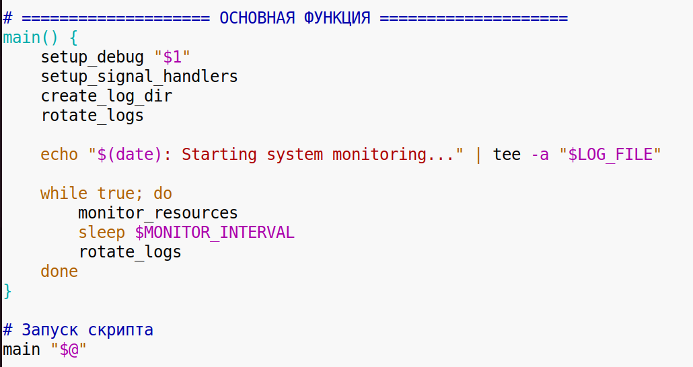
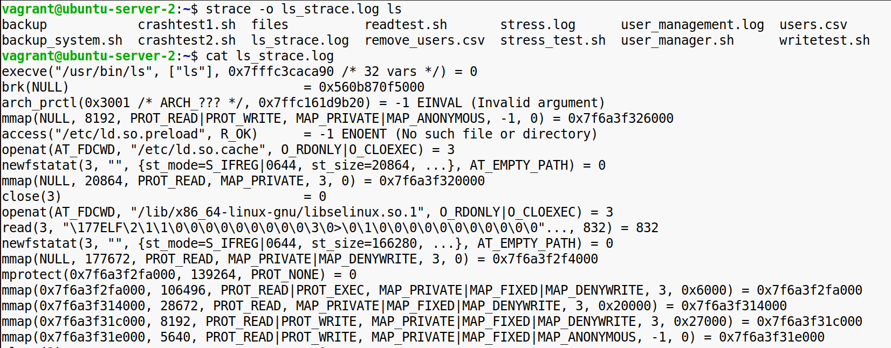
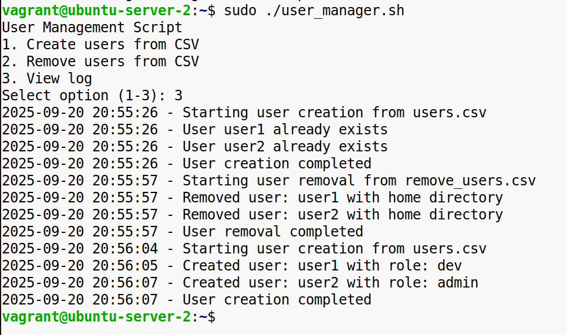

**Задание 1**

Скрипт мониторинга системы и управления логами

**Цель**: cоздать скрипт, который выполняет мониторинг системы и сохраняет результаты в лог-файлы.

**Требования**:  
1\. Мониторинг ресурсов:

\-Используйте команды для проверки загрузки CPU, памяти, места на диске.  
\-Выводите результаты в лог-файл, разделяя STDOUT и STDERR.  

2\. Управление логами:

\-Реализуйте ротацию логов (например, сохраняйте логи за последние 3 дня, старые удаляйте).  

3\. Сигналы и обработка ошибок:

\-Добавьте обработку сигналов (SIGINT, SIGTERM), чтобы скрипт корректно завершался.  

4\. Отладка:

\-Добавьте опцию для вывода отладочной информации (set -x).  

**Результат**: Рабочий скрипт, который можно запустить и проверить.  
  
  
  
  
 

**Задание 2**

Система резервного копирования и проверки целостности

**Цель**: автоматизировать процесс резервного копирования файлов и проверку целостности.

**Требования:**

1\. Создание резервных копий:

\-Напишите скрипт для инкрементального копирования файлов из заданной директории в архивы.  
\-Используйте tar или rsync для создания архивов.  
  
  
  
2\. Проверка целостности:

\-После создания архива выполните проверку целостности (например, с помощью md5sum).  

3\. Уведомления:

\-Если резервное копирование прошло успешно, добавьте запись в лог-файл.  
\-В случае ошибки перенаправьте сообщение в STDERR.  

4\. Управление расписанием:

\-Настройте выполнение скрипта через cron.  

**Результат**: полностью автоматизированная система резервного копирования.  
  

&nbsp;

&nbsp;

**Задание 3**

Анализ процессов и диагностика системы

**Цель**: провести диагностику системы с помощью инструментов анализа процессов.

**Требования**:

1\. Анализ ресурсов:

\-Напишите скрипт, который запускает несколько процессов с высокой нагрузкой на CPU, память и диск.

\-Используйте top, htop и /proc для анализа.  
  
  
 

2\. Статусы процессов:

\-Создайте процессы-зомби и сироты, проанализируйте их статус.  
  

\-Используйте ps для вывода информации о процессах.  

3\. Использование strace:

\-Выполните анализ системных вызовов для команды ls с помощью strace.  

\-Выведите в лог-файл список вызванных системных функций.  

4\. Оптимизация:

\-Измените приоритет одного из процессов (с помощью nice или ionice) и посмотрите, как это влияет на производительность.  
  
  

**Результат**: Отчет о поведении системы под нагрузкой и рекомендации по оптимизации.

&nbsp;

&nbsp;

&nbsp;

**Задание 4**

Автоматизация управления пользователями

**Цель**: создать скрипт для управления пользователями системы.

**Требования**:

1\. Создание пользователей:

\-Напишите скрипт, который создает пользователей на основе данных из CSV файла.  
  

\-Задайте каждому пользователю домашнюю директорию, сгенерируйте SSH-ключи и назначьте пароль.  

2\. Управление группами:

\-Добавьте пользователей в группы в зависимости от их роли.  
\-Проверьте и обновите права доступа на директории, связанные с группами.  

3\. Логи и отчеты:

\-Все изменения записывайте в лог-файл (например, созданные пользователи, ошибки).  

4\. Удаление пользователей:

\-Добавьте функционал для удаления пользователей, указанных в другом CSV файле, с возможностью удаления их домашней директории.  
  
  
 

**Результат**: Готовый скрипт для массового управления пользователями.  
  
  
