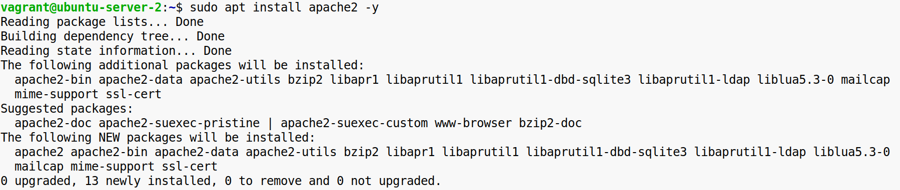
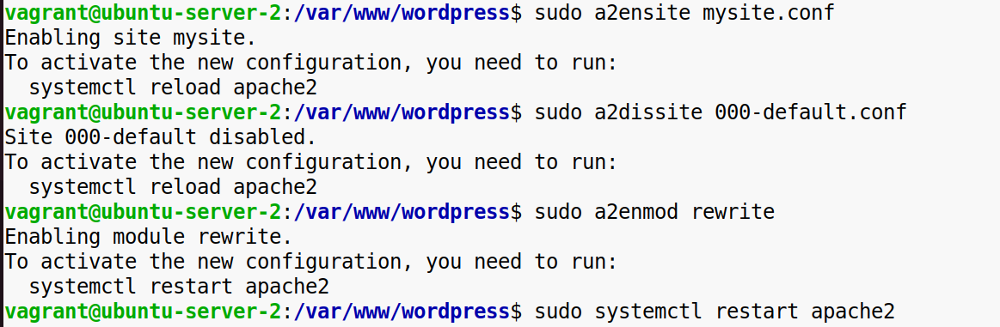
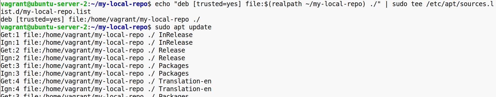
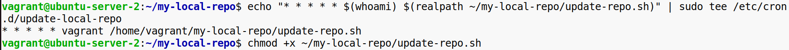
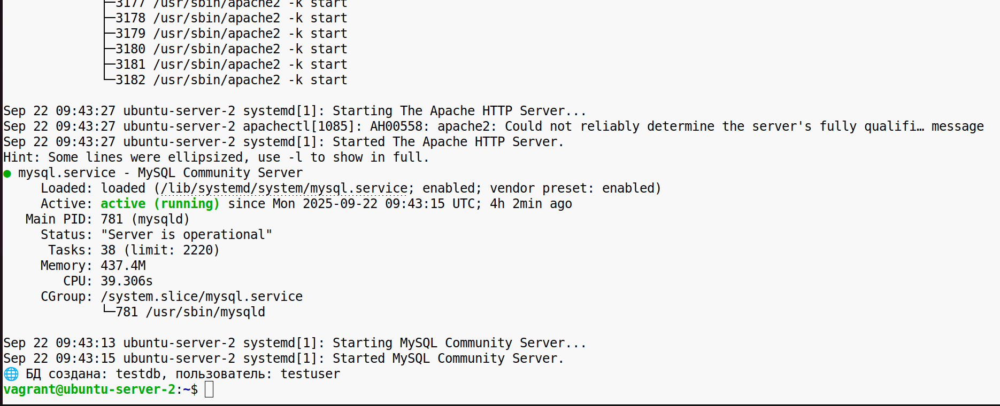

**Задание 1**

Базовая работа с пакетами

**Требования**

1\. Найти определенный пакет по имени или по описанию  

2\. Установка/удаление пакетов

\-Установить какой-либо пакет  

\-Обновить установленный пакет  

\-Удалить пакет  

3\. Изучить способы отката пакета, в случае его некорректной установки

**Задание 2**

Управление зависимостями

**Требования**

1\. Установить пакет  

2\. Проверить какие зависимости требуются для корректной работы пакета  

3\. Попробовать очистить неиспользуемые зависимости  

**Задание 3**

Развёртывание LAMP/LEMP стека

**Требования**

1\. Установить стек LAMP (Apache, MySQL/MariaDB, PHP) или LEMP (Nginx, MySQL/MariaDB, PHP).  
  

2\. Настроить phpMyAdmin для работы с базами данных.  

3\. Найти и запустить простой проект с GitHub.

4\. Написать пошаговую инструкцию по установке.  
  
  
  
  
  
  
  
   
  

**Задание 4**

Создание пакета

**Требования**

1\. Собрать пакет .deb или .rpm с конфигурационными файлами.  
2\. Ознакомиться с процессом упаковки файлов в пакет.  
  
  
  
  
 

**Задание 5**

Настройка локального репозитория

**Требования**

1\. Создать локальный репозиторий для пакетов .deb или .rpm.  
2\. Настроить автоматическое обновление через репозиторий.  
  
  
  
  
  
  

&nbsp;

**Задание 6**

Написание автоматизированного скрипта установки

**Требования**

- Написать универсальный скрипт, который:  
    \-Определяет текущую ОС и выбирает соответствующий пакетный менеджер.  
    \-Устанавливает необходимые пакеты и зависимости.  
    \-Настраивает базовые конфигурации для сервисов.  
    \-Создаёт тестовую базу данных.  
    \-Настраивает фаервол.

  
  

  
  
    

&nbsp;

&nbsp;

&nbsp;