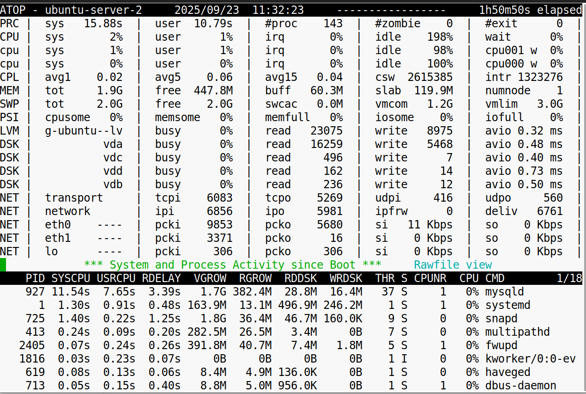

**Задание 1**

Введение в процессы

1 .Определите, какие процессы выполняются в вашей системе:

\-Выполните команду ps -aux и найдите ваш shell-процесс.  
  
\-Найдите процессы с самым высоким использованием CPU и памяти.  
  

2\. Выведите дерево процессов:

\-Используйте команду pstree и определите родительские процессы для запущенных приложений.  

**Задание 2**

Создание и управление процессами

1\. Запустите команду в фоновом режиме:

\-Выполните ping google.com > output.log &.  
\-Переведите процесс на передний план.  
\-Приостановите выполнение и возобновите в фоновом режиме.  

2\. Установите приоритеты процессам:

\-Запустите команду yes > /dev/null &.  
\-Используйте top, чтобы найти процесс, и измените его приоритет с помощью renice.  
  

3\. Остановите процесс:

Найдите PID с помощью ps и завершите процесс с помощью kill.  
\*\*  
\*\*

&nbsp;

**Задание 3**

Мониторинг процессов

1\. Запустите top и ответьте на вопросы:

\-Какие процессы занимают больше всего CPU?  

\-Как меняется нагрузка, если запустить stress или yes > /dev/null &?  

2\. Используйте htop для мониторинга:

\-Найдите процесс, идущий в фоновом режиме.  
\-Измените приоритет (Nice) прямо в интерфейсе.  
  
  
 

3\. Изучите историю работы системы с помощью atop:

\-Установите atop и запустите его с записью логов.  

\-Откройте лог и проанализируйте данные.  

**Задание 4**

Файлы и процессы

1\. Исследуйте директорию /proc:

\-Найдите ваш shell-процесс с помощью команды ps.  
\-Откройте /proc/\[PID\]/stat и объясните значения.  
  
1625 - PID процесса  
(bash) - Имя команды  
S - Текущее состояние процесса (sleeping)  
1624 - PID родительского процесса  
1625 - ID сессии  
4194304 - Флаги процесса  
20 - Приоритет планировщика  
0 - Значение nice  
9695232 - Размер виртуальной памяти в байтах

\-Определите, какие файлы открыты процессом, используя lsof.  

2.Посмотрите открытые файловые дескрипторы:

\-Запустите cat > /dev/null & в фоне.  
\-Откройте /proc/\[PID\]/fd и проверьте, какие файлы открыты.  

3\. Проанализируйте использование памяти:

\-Изучите содержимое /proc/meminfo и сравните с данными в free -h.  
  
