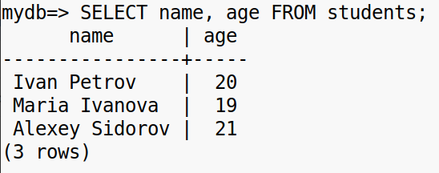
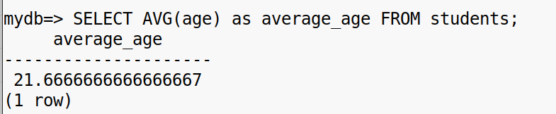
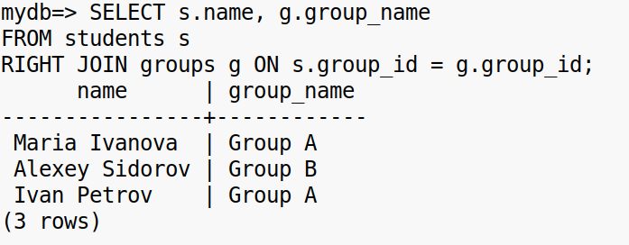

**Задание 1.**

Установка PostgreSQL:  
\-Установите PostgreSQL на сервере, следуя инструкциям для вашей операционной системы (например, sudo apt install postgresql для Ubuntu).  
Запуск и настройка службы:  
\-Запустите PostgreSQL и настройте автоматический запуск службы при старте системы.  
Создание базы данных и пользователя:  
\-Подключитесь к PostgreSQL через консоль (psql).  

\-Создайте нового пользователя для работы с базой данных, используя команду CREATE USER, и назначьте ему пароль.  
\-Создайте базу данных, которую будете использовать для выполнения заданий, и предоставьте права на нее вашему новому пользователю.  

\-Настройте конфигурацию для удаленного подключения, если это необходимо (измените параметры pg_hba.conf и postgresql.conf).  
Проверка соединения:  
\-Убедитесь, что можете подключиться к базе данных, используя созданного пользователя, и проверить работу системы на базовых командах (SELECT, INSERT и т.д.).

**Задание 2.**

Создайте таблицу students со следующими полями:  
\-student_id (тип INTEGER, первичный ключ),  
\-name (тип VARCHAR(50)),  
\-age (тип INTEGER),  
group_id (тип INTEGER, внешний ключ, ссылается на groups.group_id).  
Создайте таблицу groups:  
\-group_id (тип INTEGER, первичный ключ),  
\-group_name (тип VARCHAR(20)).  
\-Определите внешние ключи, связывающие student_id в таблице students с group_id в таблице groups.  
  
\-Объясните выбор типов данных для каждого столбца, описав, почему вы выбрали именно эти типы.

- **INTEGER** для ID - оптимальный целочисленный тип для ключей
    
- **VARCHAR(50)** для имени - достаточно для полных имен, экономит место
    
- **VARCHAR(20)** для названия группы - достаточно для названий типа "Group A"
    
- **CHECK constraint** для age - ограничение возраста студентов  
     
    

\-Создайте индекс для быстрого поиска студентов по полю name.  
\-Проверьте, как наличие индекса влияет на скорость выполнения поиска по сравнению с отсутствием индекса, выполнив простые запросы до и после создания индекса.  
  
  
  

\-Добавьте в таблицу students три записи, указав имя, возраст и группу.  

\-Также добавьте две записи в таблицу groups с названиями групп, например, Group A и Group B.  

**Задание** **3.**

Выполните следующие запросы:

\-Выберите всех студентов, отображая их имя и возраст.  

\-Выберите всех студентов, которые старше 20 лет.  

\-Выберите всех студентов вместе с их группами (используйте JOIN для объединения с таблицей groups).  

\-Обновите возраст одного из студентов, изменив его на 25 лет.  
\-Проверьте, что изменение выполнено, выполнив соответствующий запрос SELECT.  

\*-Удалите из таблицы всех студентов младше 18 лет.  
\*\*-Выполните запрос SELECT, чтобы убедиться, что студенты удалены.  
  
\*

\-Добавьте в таблицу students новый столбец enrollment_date (тип DATE).  
  
\-Удалите столбец enrollment_date, вернув таблицу к исходной структуре.  

\-Посчитайте общее количество студентов в таблице.  

\-Найдите средний возраст студентов.  

\-Выполните запрос INNER JOIN, чтобы вывести всех студентов вместе с их группами.  

\-Выполните запрос LEFT JOIN, чтобы отобразить все группы, даже если у них нет студентов  
  
\-Выполните RIGHT JOIN, чтобы увидеть студентов с их группами, даже если группа не указана.  

**Итог**

Создайте запрос, объединяющий данные из таблиц students и groups, чтобы показать список всех студентов с указанием имени группы. Если у студента нет назначенной группы, укажите “Без группы”.  
