**Задание 1. Изучите структуру каталогов.**

\-Найдите каталог /var/lib/pgsql/data на сервере.  
\-Изучите содержимое подкаталогов и запишите, какие файлы находятся в каждом из них. Откройте и просмотрите файлы postgresql.conf и pg_hba.conf.  
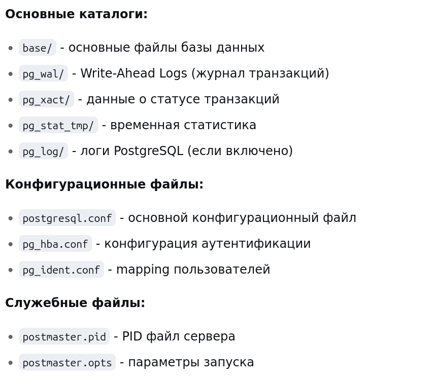

**Задание** **2\. Изменение конфигурации.**

\-В файле postgresql.conf измените настройки логирования:  
\-Включите полное логирование запросов, изменив параметр log_statement на all.  
Установите ротацию логов, например, ежедневно (используйте log_rotation_age) и при достижении размера 10 МБ (log_rotation_size).  
\-Перезапустите сервер PostgreSQL и убедитесь, что настройки применились, проверив файлы логов.  
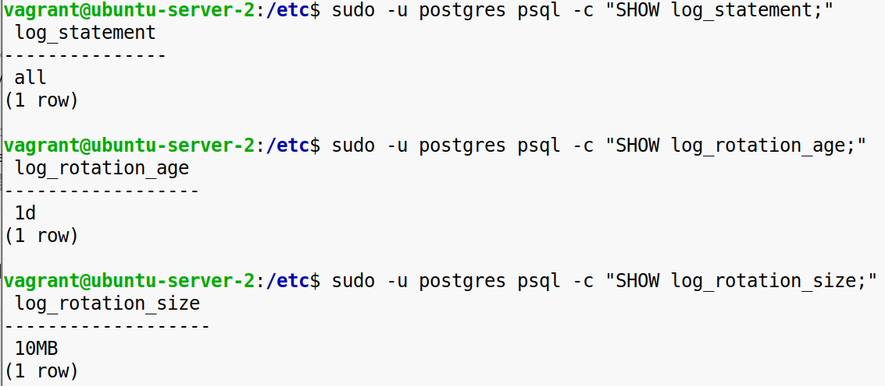  
  

**Задание** **3\. Настройка прав доступа.**

\-В файле pg_hba.conf добавьте правило для доступа к базе данных с IP-адреса 127.0.0.1 с использованием метода аутентификации md5.  
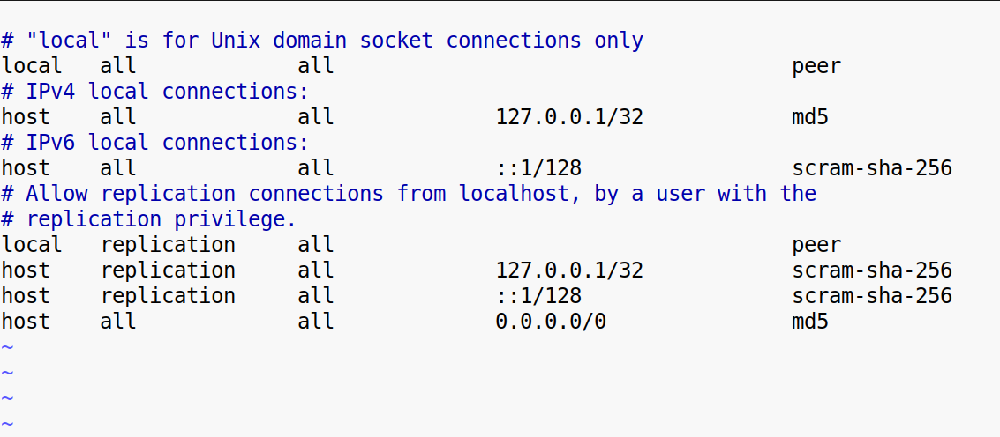

\-Перезапустите сервер PostgreSQL и подключитесь к базе данных с помощью пользователя, настроенного в предыдущем разделе, убедившись, что требуются пароль и соединение успешно.  
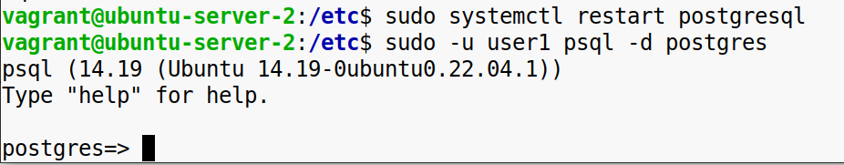  
 

&nbsp;

**Задание 4. Проверка дискового пространства.**

Используйте команду df -h для мониторинга оставшегося места в каталоге данных.  
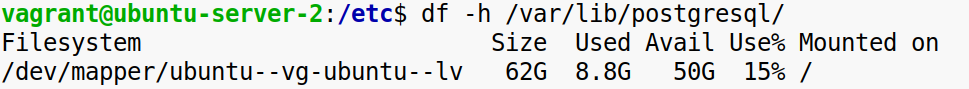

Создайте несколько тестовых таблиц с большим количеством строк (например, 100 тысяч записей) и проверьте, как это влияет на дисковое пространство.  
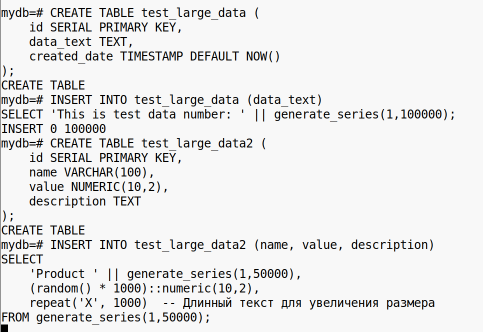  
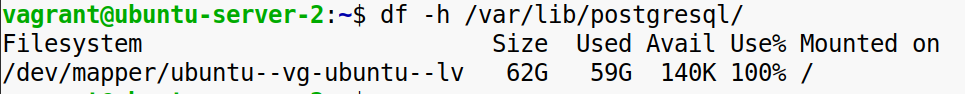

Выполните команду VACUUM для этих таблиц, чтобы освободить неиспользуемое пространство, и проверьте разницу.  
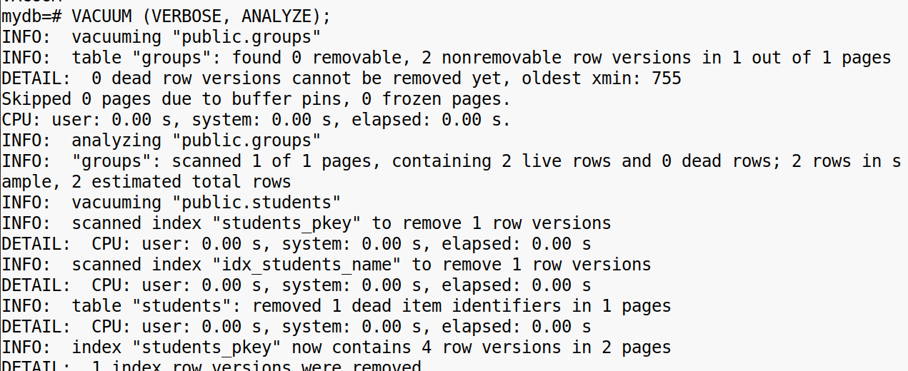  
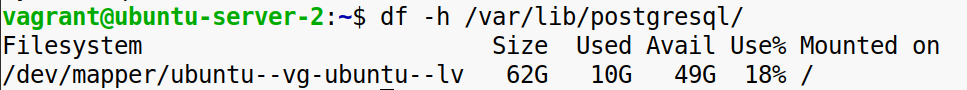

**Задание** **5\. Решение проблем аутентификации.**

Нарочно измените метод аутентификации для вашего пользователя в pg_hba.conf, например, на reject, и попытайтесь подключиться к базе. Запишите ошибку, которая будет выдана PostgreSQL.  
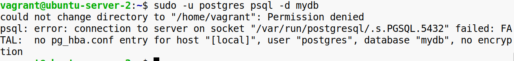

Восстановите метод аутентификации обратно на md5, подключитесь снова и убедитесь, что доступ снова работает.  
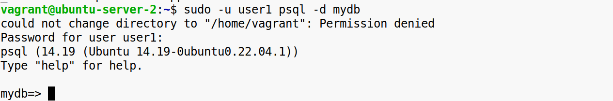  
 

**Задание** **6\. Диагностика и решение deadlock.**

Создайте таблицу с несколькими строками и проведите параллельные транзакции, которые будут пытаться блокировать одни и те же строки (можно использовать команды BEGIN, LOCK, UPDATE).  
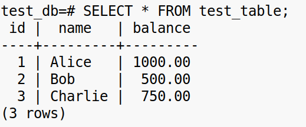  
  

Вызовите ситуацию deadlock и проследите, как PostgreSQL разрешает её. Просмотрите логи для диагностики возникшей блокировки.  
Примените команду SET deadlock_timeout и установите более низкое значение (например, 1 секунда), чтобы PostgreSQL быстрее обнаруживал deadlock.  
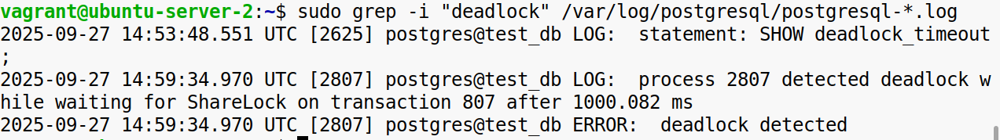