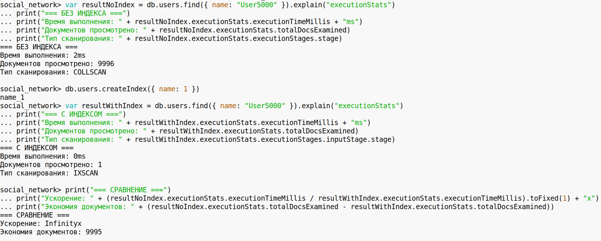

**Задание 1. Установка MongoDB и настройка окружения**

\-Установите MongoDB на свой компьютер или сервер  
\-Настройте базу данных, создайте основную коллекцию users, в которой будут храниться профили пользователей. Каждая запись должна содержать поля: user_id, name, age, friends (список идентификаторов друзей).  

\-Изучите интерфейс командной строки MongoDB или MongoDB Atlas для выполнения запросов.  
 

**Задание 2. Создание и добавление данных**

Создайте несколько документов в коллекции users, используя такие поля:  
\-user_id: уникальный идентификатор пользователя.  
\-name: имя пользователя.  
\-age: возраст пользователя.  
\-friends: массив идентификаторов друзей.  
Добавьте пять различных записей, при этом каждая запись должна иметь разное количество друзей.  
Используйте команду insertOne() для добавления одного документа и insertMany() для добавления нескольких записей за один запрос.  

**Задание 3. Извлечение данных и фильтрация**

Используйте команды find() и findOne() для извлечения информации о пользователях:  
\-Извлеките всех пользователей с возрастом больше 20 лет.  

\-Найдите пользователя по имени и отобразите его друзей.  

\-Извлеките пользователей, у которых в списке друзей определенное количество друзей.  

\-Попробуйте отсортировать результаты по возрасту в порядке убывания.  

**Задание 4. Использование вложенных данных и массивов**

\-Добавьте к документам пользователей дополнительное поле posts, представляющее собой массив объектов. Каждый объект в массиве posts должен включать: post_id, content, date.  

\-Используйте MongoDB запрос для извлечения пользователей с определенной фразой в посте.  

\-Убедитесь, что запросы извлекают только нужные данные, используя проекцию (.find({}, { поле: 1 })).  

**Задание 5. Изучение индексов для оптимизации поиска**

\-Создайте индекс для поля name в коллекции users для ускорения поиска пользователей по имени.  
\-Сравните время выполнения поиска по полю name до и после создания индекса. Сначала выполните поиск без индекса, зафиксируйте время выполнения, затем создайте индекс и повторите запрос, сравнив время.  

**Задание 6. Обновление и удаление данных**

\-Обновите возраст одного из пользователей, увеличив его на 5 лет, используя команду updateOne().  

\-Удалите всех пользователей младше 18 лет с помощью команды deleteMany().  

\-После удаления выполните запрос для подтверждения удаления.  

**Задание 7.Бэкап и восстановление данных**

\-Создайте резервную копию коллекции users с помощью команды mongodump.  

\-Удалите один из документов в коллекции, а затем восстановите коллекцию из резервной копии с помощью mongorestore.  
  
sudo mongorestore --db=social_network --collection=users /tmp/mongobackup/social_network/users.bson  
