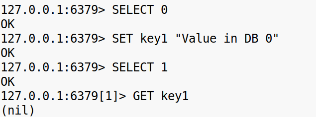
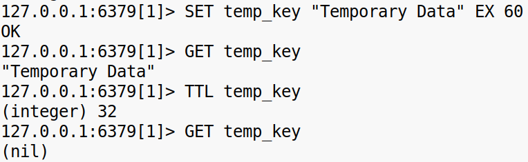

**Задание 1. Установка Redis**

\-На Linux-сервере установите Redis с помощью пакетного менеджера. Пример для Ubuntu:  
sudo apt update  
sudo apt install redis-server  
\-Запустите Redis и убедитесь, что сервис работает корректно:  
sudo systemctl start redis-server  
sudo systemctl status redis-server  

\-Подключитесь к Redis-клиенту и выполните несколько команд (PING, SET, GET), чтобы проверить, что база данных функционирует:  
redis-cli  
\> PING  
\> SET example "Hello, Redis!"  
\> GET example  
  
 

**Задание 2. Настройка конфигураций Redis**

Изучите конфигурационный файл Redis (/etc/redis/redis.conf) и внесите изменения для повышения безопасности  
\-Ограничьте доступ к Redis только для localhost, изменив параметр bind:  
bind 127.0.0.1  
  
 \-Установите пароль для подключения к Redis, добавив параметр requirepass:  
requirepass yourpassword  
\-Перезапустите Redis для применения изменений:  
sudo systemctl restart redis-server  
 

**Задание 3. Работа с базами данных**

Используйте несколько баз данных Redis, переключаясь между ними с помощью команды SELECT. Вставьте данные в разные базы данных и убедитесь, что данные из одной базы недоступны в другой  
SELECT 0  
SET key1 "Value in DB 0"  
SELECT 1  
GET key1  
  
 

**Задание 4. Кэширование данных**

\-Попробуйте использовать Redis для кэширования: создайте ключи с временным сроком действия (TTL). Установите ключ с временем жизни в 60 секунд и убедитесь, что по истечении времени он удаляется  
SET temp_key "Temporary Data" EX 60  
GET temp_key  
\-Используйте команду TTL, чтобы проверить оставшееся время жизни ключа.  
  
 

**Задание 5. Хранение данных в различных структурах**

Создайте ключи, используя различные структуры данных Redis  
\-Список. Добавьте несколько элементов и извлеките их.  
RPUSH mylist "element1" "element2" "element3"  
LRANGE mylist 0 -1  
  
\-Множество. Добавьте элементы и проверьте уникальность.  
SADD myset "item1" "item2" "item1"  
SMEMBERS myset  

\-Хеш. Сохраните и извлеките данные как в JSON-структуре.  
HSET user:1000 name "Alice" age "30"  
HGETALL user:1000  
  
 

**Задание 6.Команда INFO**

Используйте команду INFO для получения статистики по ключевым параметрам Redis, таким как использование памяти и количество подключений. Проверьте секции Memory, Clients и Persistence.  
INFO Memory  
  
INFO Clients  
  
INFO Persistence  
  
 

**Задание 7. Проверка эффективности**

\-Установите ограничение на память с параметром maxmemory и выберите eviction-политику в конфигурационном файле redis.conf. После перезапуска Redis вставьте данные, пока не будет достигнут лимит памяти, и проверьте, как происходит удаление старых ключей.  
\-Используйте команды для мониторинга использования памяти:  
CONFIG SET maxmemory 100mb  
CONFIG SET maxmemory-policy allkeys-lru  

\-Проверьте, как используется память до и после удаления данных, с помощью команды MEMORY USAGE.  
  
  
 

**Задание 8. Резервирование данных**

\-Настройте резервное копирование данных с помощью режима RDB, который автоматически создает снапшоты. Измените параметры в redis.conf для настройки интервала бэкапов и проверьте, где создаются резервные файлы.  

\-Проверьте, что данные сохраняются на диск, после чего остановите и перезапустите Redis. Убедитесь, что данные восстанавливаются после перезапуска.  
  
