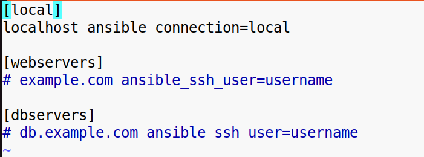
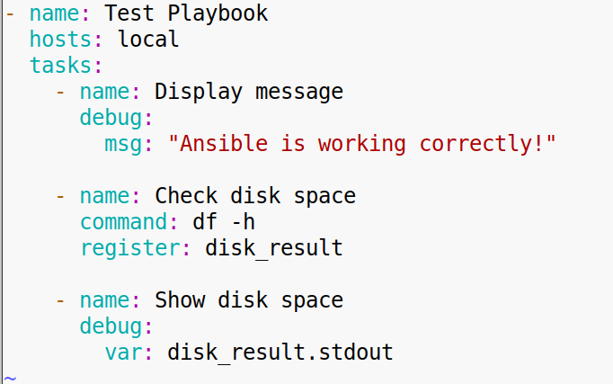
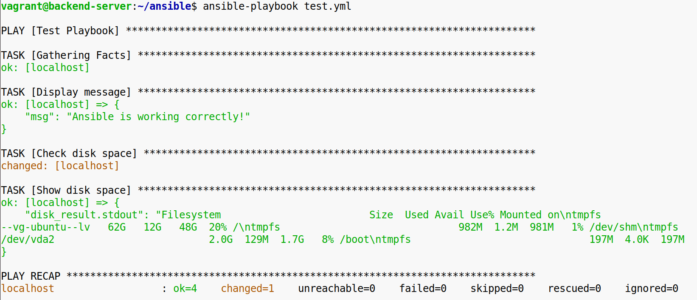
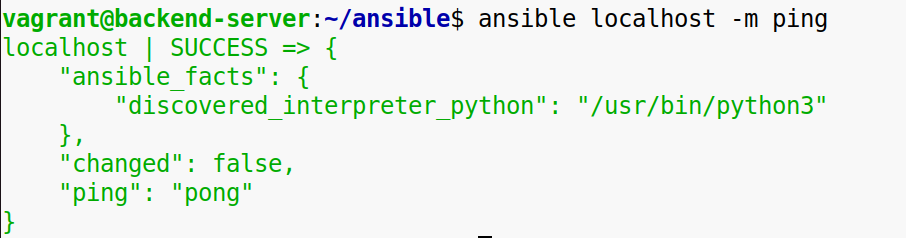

Задание 1. Установка Ansible и запуск ad-hoc команды

**1\. Установите Ansible** на своём окружении (Ubuntu, CentOS, macOS, Windows + WSL, и т. д.). Найдите подходящий способ установки в документации для вашей платформы. Убедитесь, что после установки Ansible корректно запускается.

**2 Проверьте работоспособность**: запустите простую ad-hoc команду, чтобы удостовериться, что Ansible может обращаться к локальному хосту, и проследите, чтобы она выполнилась успешно. Для этого может потребоваться базовый файл inventory или указание хоста напрямую. В результате вы должны получить подтверждение, что управляющая машина (Control Node) может взаимодействовать с вашим хостом.  
 inventory  

ansible.cfg  
  
 playbook  
  
   
 

**Конечный результат:**
\-Ansible установлен на локальной машине.  
\-Успешное выполнение ad-hoc команды подтверждает, что управление локальным хостом работает.