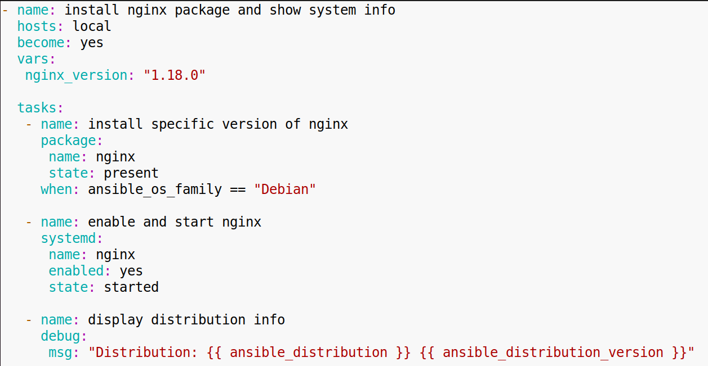
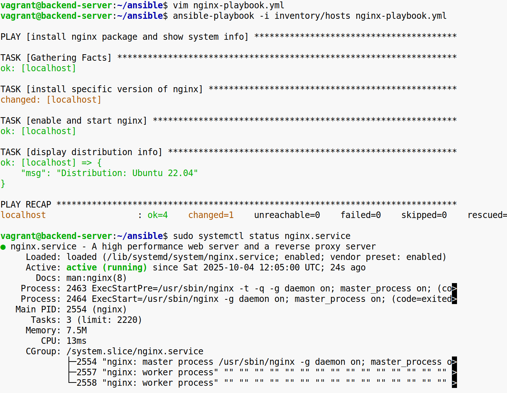

**Задание 1. Установка пакета, запуск службы и вывод системного факта**

**1\. Подготовьте окружение:** Убедитесь, что на целевой машине с Linux-дистрибутивом установлены все необходимые зависимости для Ansible. Если необходимо, настройте инвентори (hosts) с указанием адреса (или имени) вашего сервера.

**2\. Создайте playbook, в котором:**

\-Будут храниться переменные для задания версии пакета (например, nginx_version), чтобы легко менять, какую версию установить.  
\-Должны быть задачи (tasks) для:  
1\. Установки нужного пакета (например, Nginx) выбранной версии.  
2\. Включения (enable) и запуска (start) этой службы.  
3\. Вывода одного из системных фактов (например, ansible_distribution) — чтобы убедиться, что сбор фактов действительно работает.  
  
 **3\. Проверьте результат:**

\-Убедитесь, что Ansible корректно устанавливает пакет и выводит соответствующую информацию о дистрибутиве.  
\-Проверьте, что служба действительно работает, и она включена автоматически при перезагрузке.  

**  
Конечный результат:** Запущенная служба (которую выберете для установки, например, Nginx) и наглядный вывод факта об установленном дистрибутиве в процессе выполнения playbook.