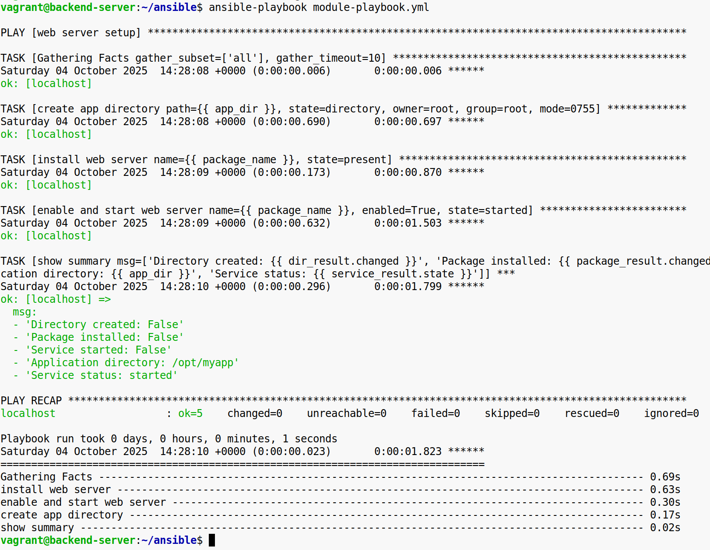

**Задание 1. Выполнить ad-hoc команду для проверки пакета**

1\. Подготовьте окружение: убедитесь, что у вас есть Ansible и что локальный хост прописан в инвентори.  
2\. Попробуйте однократно проверить (или установить) нужный пакет на локальном хосте, используя ad-hoc команду и один из базовых модулей Ansible.  
3\. Убедитесь, что Ansible корректно сообщает об успехе или необходимости обновления пакета.  

**Результат:** Пакет либо подтверждён как установленный, либо установлен только что, а Ansible показывает соответствующую информацию.

&nbsp;

**Задание 2. Написать playbook с несколькими популярными модулями**

1\. Создайте плейбук, нацеленный на локальный хост или тестовую виртуальную машину.  
2\. Опишите в нём несколько задач:  
\-Создание (или изменение) директории для приложения с помощью одного из модулей управления файлами.  
\-Установка нужного пакета (например, веб-сервера или любой другой) с помощью модуля управления пакетами.  
\-Запуск и включение сервиса в автозагрузку с помощью модуля управления службами.  
\-Убедитесь, что плейбук успешно отрабатывает и сообщает об установке/изменении.  
  
   
  
**Результат:** После выполнения плейбука на целевом хосте должна появиться подготовленная директория и установленный/запущенный сервис.

&nbsp;

**Задание 3. Настроить более подробный вывод логов с помощью callback-плагина**

1\. Изучите, какие callback-плагины доступны по умолчанию в Ansible. При желании найдите дополнительные или пользовательские.  

2\. Настройте ansible.cfg (или иные конфигурационные файлы) так, чтобы при выполнении задач вывод был более детальным (например, подробный формат JSON, отдельный лог-файл и т. д.).  

3\. Проведите тест, запустив свой плейбук из предыдущего шага и убедившись, что вывод теперь содержит дополнительные подробности.  

**Результат:** Логи Ansible приобрели более детальную форму, что позволяет вам анализировать каждую задачу и видеть, какие именно изменения в системе происходили.