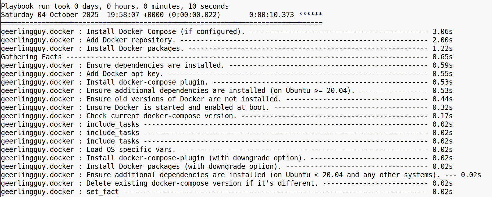

**Задание 1. Шифрование секретных переменных и использование готовой роли из Ansible Galaxy**

1\. Подготовьте рабочее окружение Ansible. Убедитесь, что на локальной машине или виртуальной машине установлена актуальная версия Ansible.  
2\. Создайте YAML-файл, где будут храниться несколько тестовых конфиденциальных данных (логины, пароли, токены).  
Содержание может быть любым, лишь бы это были «секретные» переменные.  

3\. Используя функциональность Ansible Vault, зашифруйте этот файл. Проверьте, что теперь содержимое в репозитории выглядит как зашифрованный текст. При этом вы должны иметь возможность расшифровать или отредактировать файл без хранения открытой версии на диске.  

4\. Убедитесь, что Ansible при запуске плейбуков получает доступ к этим переменным, и что они не «утекают» в логах или историях версий.

* * *

* * *

* * *

* * *

5\. Определите, какую роль из Ansible Galaxy вы хотите использовать. Можно взять любую, например, роль для установки Docker. По возможности изучите документацию и учтите все требования к окружению.  
6\. Загрузите найденную роль в свой проект, пользуясь подходящим способом из описания на Galaxy (либо через отдельный файл зависимостей, либо напрямую).  
 requirements.yml  

* * *

  
 

7\. Создайте короткий playbook, в котором вы подключите эту роль к своему локальному хосту (или тестовому серверу).  
   

Проверьте, что роль действительно устанавливает нужное ПО и отрабатывает без ошибок.  
 

8\. Если вам нужно изменить какие-то настройки роли, попробуйте переопределить её переменные в вашем playbook или инвентори. Проанализируйте, корректно ли применение настроек.