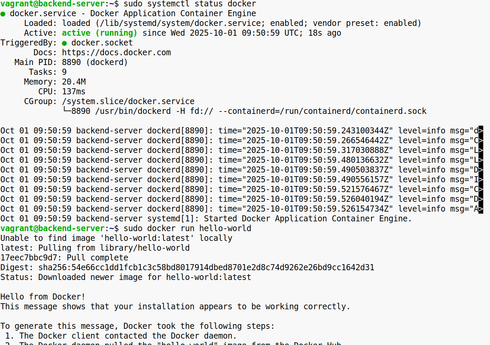

**Задание 1**

1\. Установите Docker на выбранной операционной системе (Windows, macOS или Linux). Для Linux можно использовать дистрибутив Ubuntu, WSL или виртуальную машину. Убедитесь, что установка прошла успешно.  
2\. Проверьте, что Docker Daemon запущен.  
\-Используйте системные инструменты или команды для проверки состояния службы Docker.  
\-Убедитесь, что демон Docker работает корректно.  
3\. Запустите тестовый контейнер:  
\-Выполните команду для запуска стандартного тестового контейнера (hello-world) и проверьте, что он успешно отработал.  

Конечный результат: Docker установлен, Docker Daemon запущен, команда запуска тестового контейнера выполнена успешно, и вы видите соответствующее сообщение в выводе.