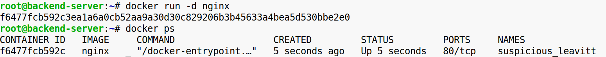
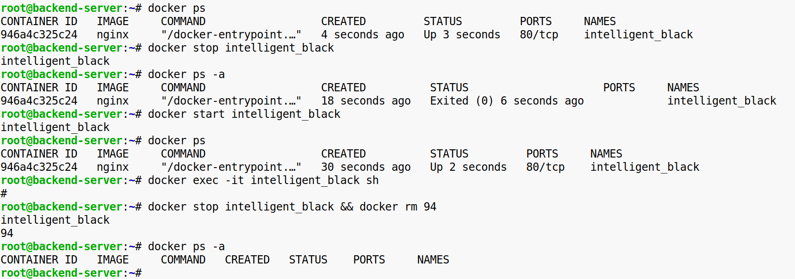
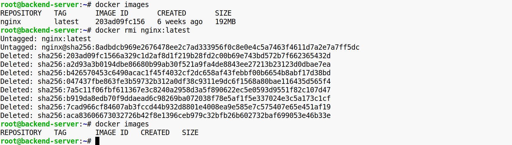

**Задание 1.**

1\. Создайте и запустите контейнер:

\-Используйте новый образ из Docker Hub, например, redis (или другой интересный для вас).  
\-Запустите контейнер в фоновом режиме, укажите имя контейнера.  

2\. Изучите жизненный цикл контейнера:

\-Проверьте список запущенных контейнеров.  
\-Остановите контейнер.  
\-Перезапустите контейнер.  
\-Подключитесь к контейнеру для выполнения команды внутри него.  
\-Удалите контейнер после завершения работы.  

3\. Работа с локальными образами:

\-Просмотрите список локальных образов.  
\-Удалите ненужный образ, чтобы освободить место.  

Конечный результат:  
Вы запустили контейнер на основе нового образа, изучили его жизненный цикл (остановка, перезапуск, выполнение команд внутри) и поработали с локальными образами для управления ресурсами.

&nbsp;

&nbsp;

&nbsp;