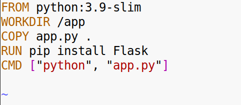
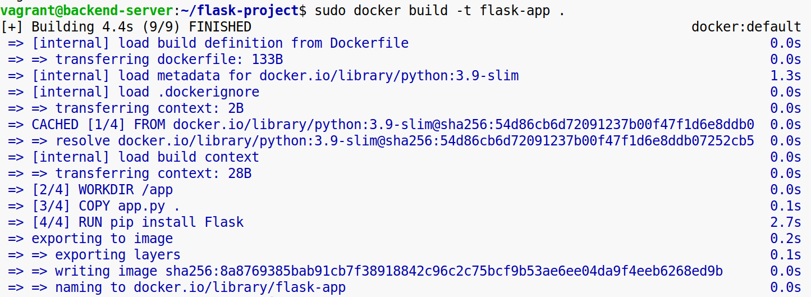
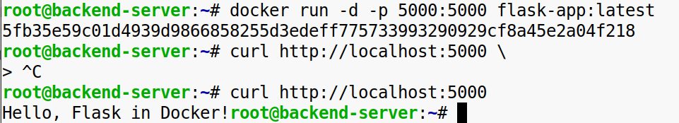
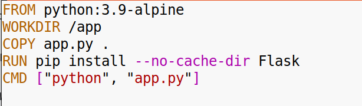
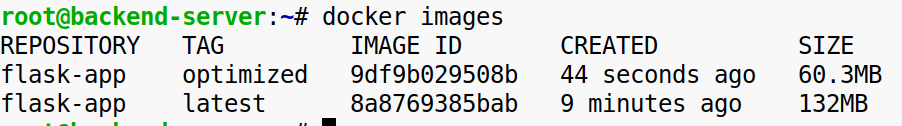
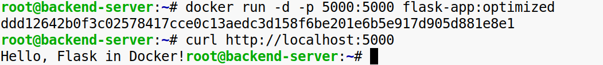

**Задание 1. Написание и оптимизация Dockerfile для веб-приложения на Flask**

1\. **Используйте следующее простое приложение на Flask**:

\# app.py

```
from flask import Flask
app = Flask(__name__)
@app.route("/")
def home():
    return "Hello, Flask in Docker!"
if __name__ == "__main__":
    app.run(host="0.0.0.0", port=5000)
```

2\. **Напишите Dockerfile**:

\-Используйте базовый образ python:3.9-slim.  
\-Скопируйте приложение в контейнер.  
\-Установите Flask как зависимость.  
\-Настройте запуск приложения при старте контейнера.  
  
  
  
<br/>

3\. **Оптимизируйте Dockerfile**:

\-Уменьшите размер образа, используя более лёгкий базовый образ (например, python:3.9-alpine).  
\-Убедитесь, что в образе не остаётся лишних файлов, включая кеши.  
  
  


**Конечный результат**: Dockerfile, который позволяет собрать минимальный работающий образ для Flask-приложения. Приложение корректно запускается и возвращает сообщение "Hello, Flask in Docker!".