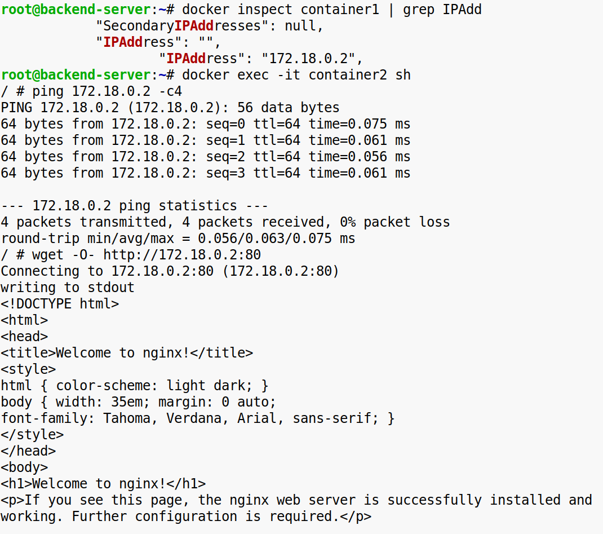

**Задание 1. Подключение тома и работа с сетями Docker**

**1\. Подключите том к контейнеру:**

\-Создайте том и подключите его к контейнеру.  
  

  
\-Проверьте, что данные, созданные в контейнере, сохраняются в томе и доступны после перезапуска или удаления контейнера.  

**2\. Изучите работу сетей в Docker:**

\-Создайте пользовательскую сеть Docker.  

\-Запустите контейнер в этой сети.  
  

\-Проверьте, что сеть позволяет изолировать контейнеры и взаимодействовать между ними через DNS-имена или IP-адреса.  
  

**Конечный результат:**

Данные из контейнера сохраняются в подключённом томе.  
Вы создали пользовательскую сеть и проверили её функциональность.