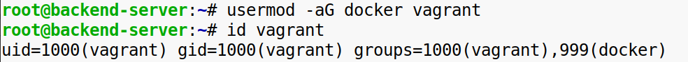
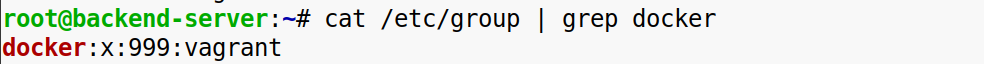
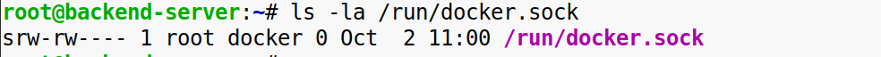
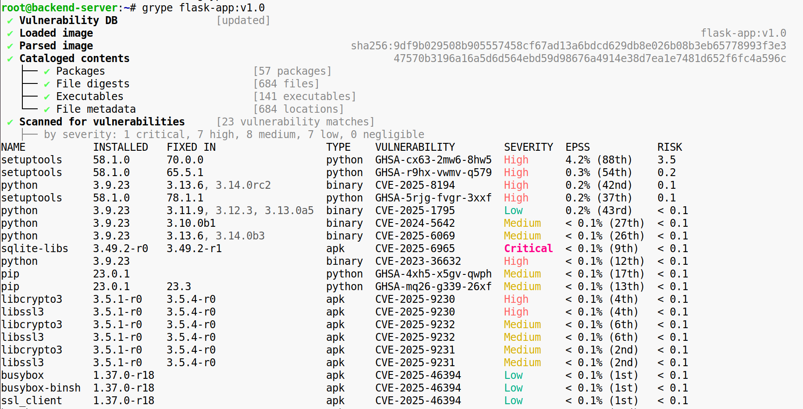
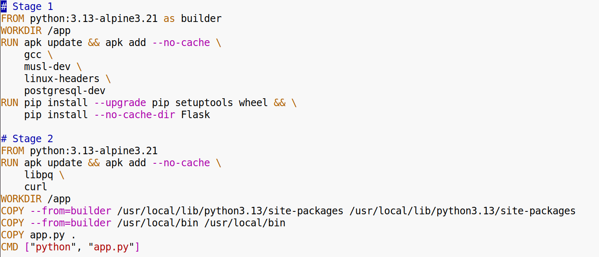
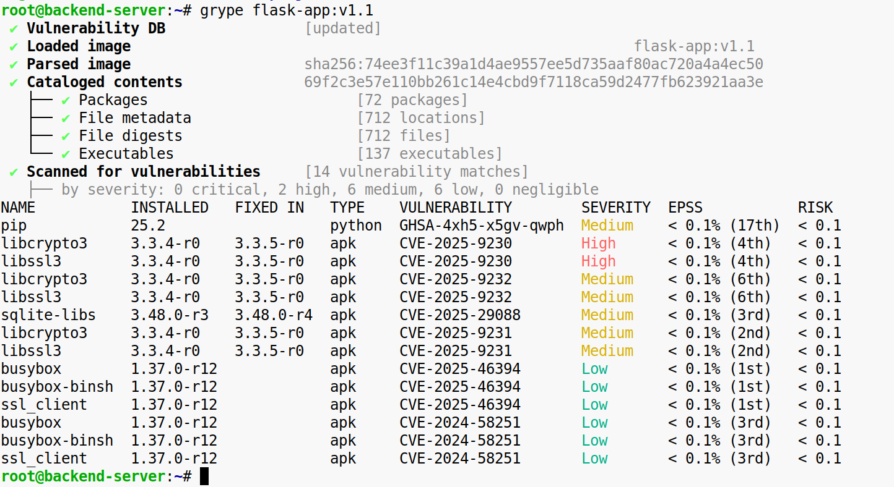

**Задание 1. Настройка безопасности Docker Daemon и сканирование образа**

**1\. Настройте безопасность Docker Daemon**:

\-Ограничьте доступ к Docker Daemon:  
\-Настройте использование группы docker, чтобы только её участники могли управлять контейнерами.  
  

\-Проверьте права доступа к файлу docker.sock и ограничьте их для безопасности.  
  
 

**2\. Сканируйте созданный образ на уязвимости**:

\-Выберите созданный вами ранее Docker-образ.  
\-Используйте инструмент для сканирования (например, Trivy).  
\-Проанализируйте результат сканирования, обратите внимание на уязвимости и примите меры по их устранению.  

  
  
 **Конечный результат**:  
Docker Daemon настроен с учётом базовых мер безопасности.  
Образ просканирован на наличие уязвимостей, и вы получили информацию о возможных рисках.