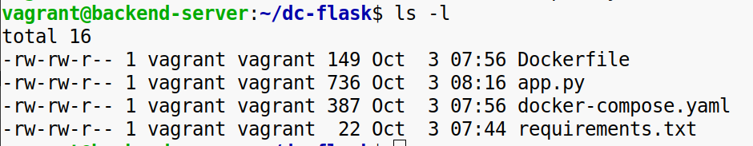
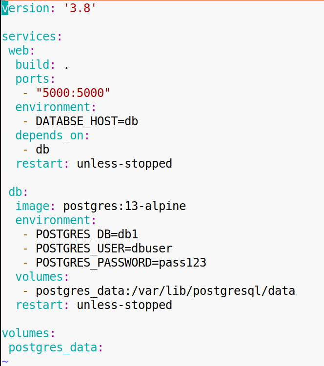
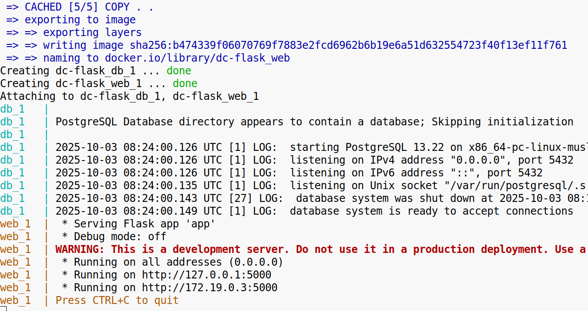

**1\. Создайте веб-приложение на Flask:**

\-В папке проекта создайте директорию app и внутри неё файл app.py со следующим кодом:  
\# app.py

```python
from flask import Flask
import psycopg2
app = Flask(__name__)
@app.route("/")
def home():
    try:
        conn = psycopg2.connect(
            dbname="mydatabase", # Замените на имя БД из docker-compose.yml
            user="user", # Замените на пользователя из docker-compose.yml
            password="password", # Замените на пароль из docker-compose.yml
            host="db" # Замените на имя сервиса базы данных из docker-compose.yml
        )

        conn.close()
        return "Connected to the database successfully!"
    except Exception as e:
        return f"Error: {e}"
if __name__ == "__main__":
    app.run(host="0.0.0.0", port=5000)
```

В той же папке создайте файл requirements.txt:  
flask  
psycopg2-binary  


**2\. Создайте docker-compose.yml:**

\-В корне проекта создайте файл docker-compose.yml для настройки двух сервисов: Flask-приложения и базы данных PostgreSQL.  
Укажите параметры подключения к базе данных (POSTGRES_USER, POSTGRES_PASSWORD, POSTGRES_DB).  


**3\. Запустите проект через Docker Compose**:

\-Соберите и запустите контейнеры:  
docker-compose up -d  
\-Убедитесь, что Flask-приложение запущено и слушает на порту 5000.  


**4\. Проверьте работу приложения:**

\-Перейдите в браузере по адресу http://localhost:5000.  
\-Убедитесь, что приложение подключается к базе данных и отображает сообщение о статусе соединения.  


**Конечный результат:**

\-Flask-приложение работает в одном контейнере и успешно взаимодействует с PostgreSQL в другом.  
\-Данные базы сохраняются между перезапусками благодаря настройке тома.