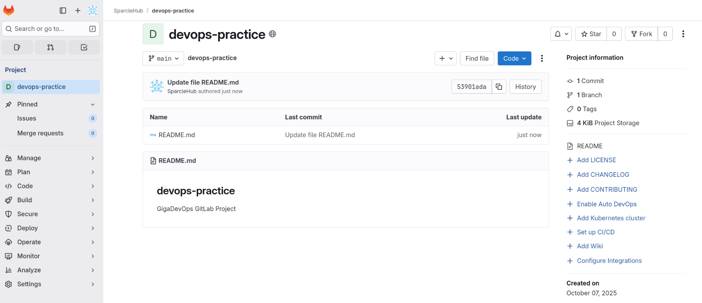
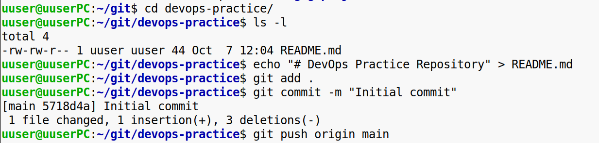
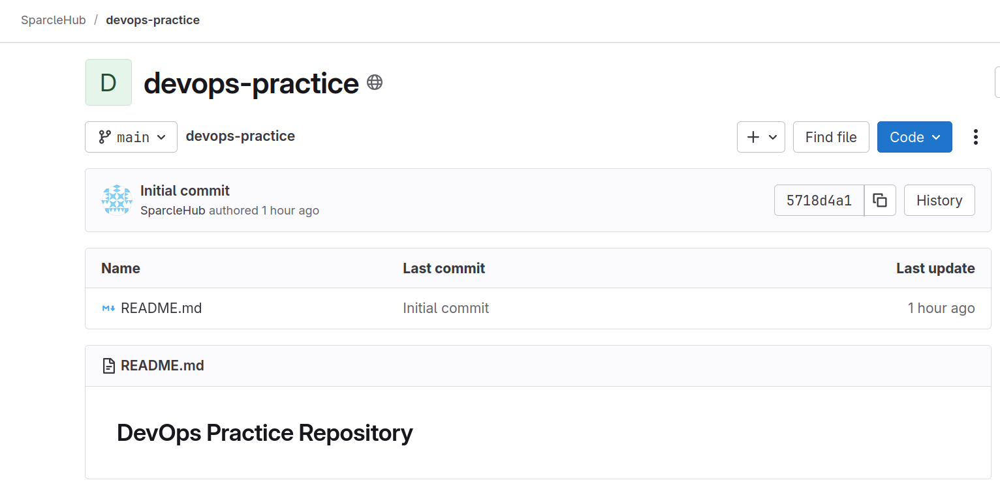

**Создаём тестовый GitLab-репозиторий**

1\. Зарегистрируйтесь на GitLab https://about.gitlab.com/  
2\. Создайте новый репозиторий:  
\-Дайте ему название (например, devops-practice).  
\-Добавьте описание, чтобы объяснить его цель.  
\-Инициализируйте репозиторий с файлом README.md.  

3\. Настройте локальный доступ:

\-Установите Git (если он еще не установлен).  
\-Клонируйте репозиторий на локальную машину с помощью команды:  
git clone https://gitlab.com/your-username/devops-practice.git  
\-Перейдите в каталог репозитория и создайте новый файл:  
cd devops-practice  
echo "# DevOps Practice Repository" > README.md  
\-Закоммитьте и отправьте изменения в репозиторий:  
git add .  
git commit -m "Initial commit"  
git push origin main  

**Конечный результат:** У вас должен быть настроенный GitLab-репозиторий, доступный локально и в облаке, с возможностью коммитить и пушить изменения.  
