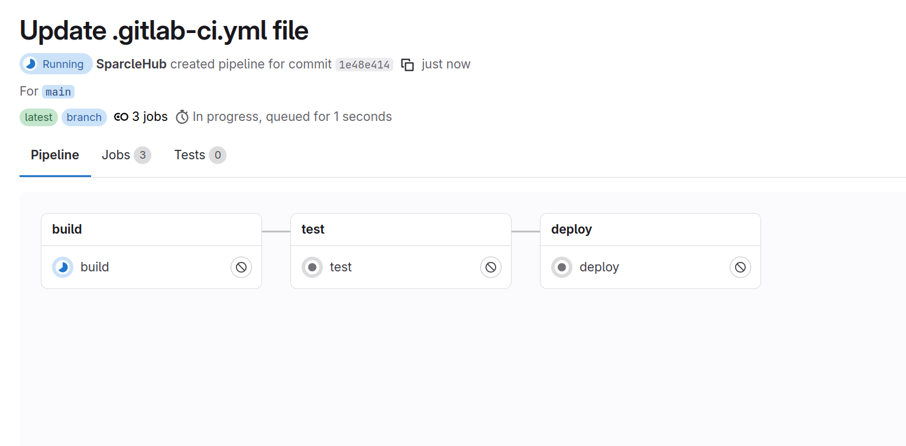
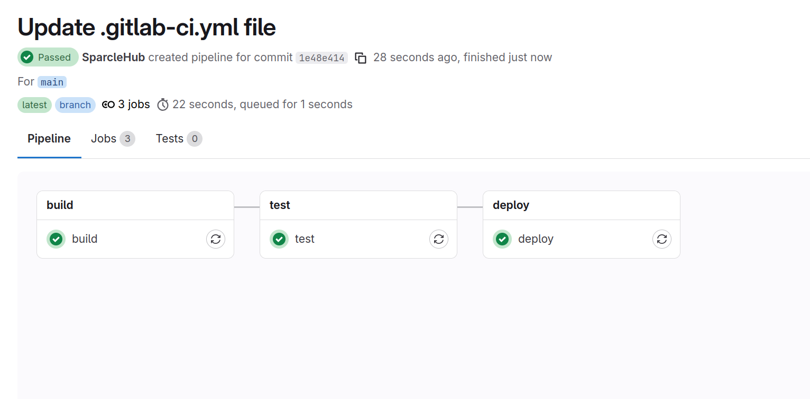
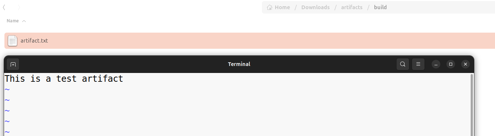

**Задание 1. Запуск и анализ GitLab CI/CD пайплайна**

1\. Используйте ранее созданный репозиторий в GitLab и загрузите в него следующий .gitlab-ci.yml файл:  
 stages:  
 - build  
 - test  
 - deploy

build:  
 stage: build  
 script:  
  - mkdir -p build  
  - echo "This is a test artifact" > build/artifact.txt  
  - ls -la build/  
 artifacts:  
  paths:  
   - build/

test:  
 stage: test  
 script:  
  - echo "Running tests..."

deploy:  
 stage: deploy  
  script:  
   - echo "Deploying the application..."

2\. Закоммитьте и запушьте изменения в репозиторий.  
3\. Перейдите в **Build** -> **Pipelines** в GitLab и убедитесь, что пайплайн запущен.

4\. Дождитесь завершения всех стадий и просмотрите логи выполнения каждого шага.  

**Задание 2. Проверка артефактов**

После успешного выполнения пайплайна перейдите в раздел **Build -> Jobs.  
**Откройте последний успешно выполненный build-job.  
Найдите раздел Artifacts и скачайте созданный артефакт.  
Распакуйте загруженный архив и убедитесь, что в нем содержится файл artifact.txt.  
Откройте этот файл и убедитесь, что в нем записано This is a test artifact.  

**Конечный результат**: Успешно запущенный пайплайн, сформированный артефакт и проверенный его содержимое.