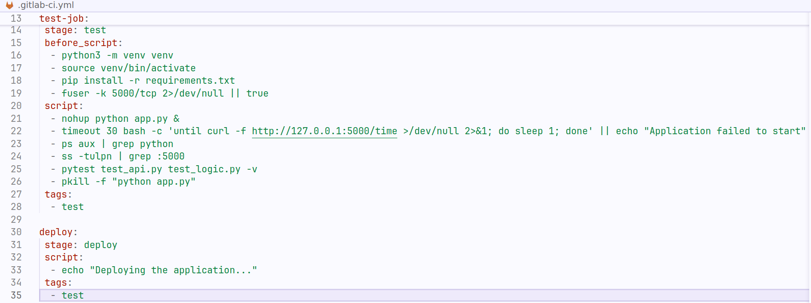

**Задание 1. Настройка CI/CD пайплайна**

Используйте ранее созданный репозиторий в GitLab и загрузите в него следующие файлы:  
\-арр.ру - реализация АРІ-сервиса на Python.  
\-requirements.txt- управление зависимостями.  
\-test_api.py и test_logic.py - тесты для АРІ и бизнес-логики.

1\. Настройте .gitlab-ci.yml в репозиторий, включив в него этапы build, test и deploy.  
2\. Реализуйте build-job, который просто выполняет роль заглушки.  
3\. Реализуйте test-job:  
\-Используйте образ Python, например, python:3.9, для запуска тестов.  
\-Перед выполнением тестов обязательно установите зависимости из requirements.txt, используя pip install -r requirements.txt.  
\-Для test-api перед запуском тестов запустите АРІ, используя python app.py &, чтобы сервер работал во время тестов.  
\-Используя рytest test_api.py test_logic.ру запустите тестирование.  
3\. Реализуйте deploy-job, который просто выполняет роль заглушки.  
  
  
  
  
4\. Закоммитьте и отправьте изменения в репозиторий, убедитесь в успешном выполнении пайплайна.  

Конечный результат: Успешно настроенный CI/CD пайплайн, включающий сборку (заглушка), тестирование сервиса на Python и деплой (заглушка).