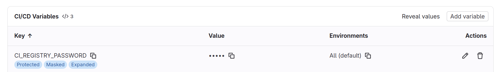
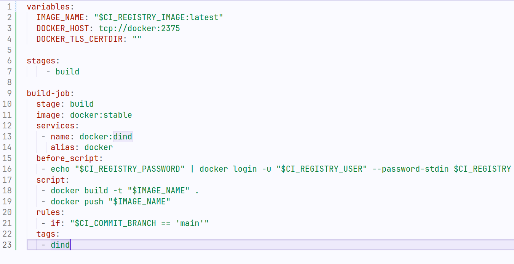
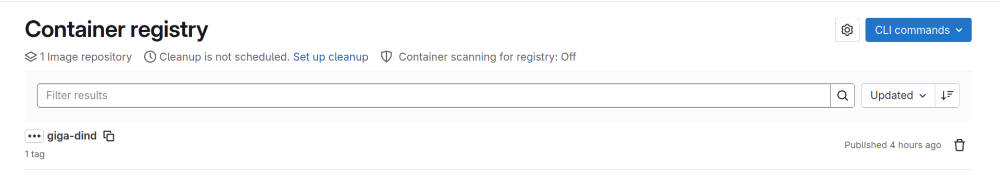
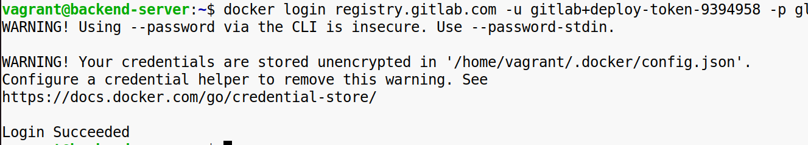
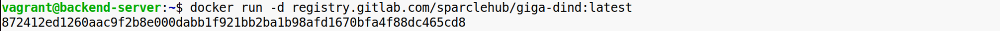
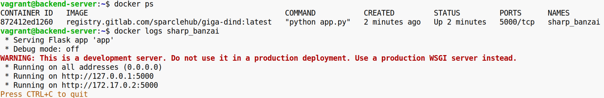
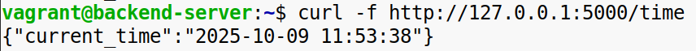

**Задание 1. Загружаем образ в GitLab Container Registry**

**1\. Проверка доступности Container Registry**:  
\-Перейдите в **Deploy > Container Registry** в вашем проекте на GitLab.  
\-Если видите сообщение There are no container images stored for this project, это означает, что Registry доступен, но в него еще не загружены образы.  
**2\. Создание Personal Access Token (PAT) для аутентификации в Container Registry**:  
\-Перейдите в **GitLab** → кликните на ваш аватар в правом верхнем углу → **Edit Profile**.  
\-В левом меню выберите **Access Tokens**.  
\-Нажмите Add new token.  
\-Введите имя токена (например, container-registry-token), установите срок действия (или оставьте пустым для бессрочного токена).  
\-Установите галочки на **read_registry** и **write_registry**.  
\-Нажмите **Create personal access token**.  
\-Сохраните полученный токен, далее добавим его в переменные CI/CD как CI_REGISTRY_PASSWORD.  

**3\. Настройка переменных в GitLab CI/CD**:

\-Перейдите в **Settings > CI/CD > Variables**.  
\-Нажмите **Add variable** и добавьте следующие переменные:  
**\-CI_REGISTRY** → registry.gitlab.com  
**\-CI_REGISTRY_IMAGE** → registry.gitlab.com/$CI_PROJECT_PATH (Flags - Expand variable reference: Enable)  
**\-CI_REGISTRY_USER → Ваш GitLab u sername  
****\-CI_REGISTRY_PASSWORD → Personal Access Token (PAT) (Visibility: Masked)  
 ****4\. После тестирования** необходимо настроить **развертывание** собранного образа в **GitLab Container Registry**. - **Определить** stage для **деплоя** – этот job должен выполняться после тестирования.  
**\-Использовать образ Docker** – выберите подходящий **image**, например, docker:24.0.5.  
\-Запустить Docker-in-Docker (например, docker:24.0.5) – добавьте **services**, чтобы контейнер имел доступ к Docker-демону.  
**\-Аутентифицироваться в GitLab Registry** – перед docker push необходимо выполнить **авторизацию** с использованием CI_REGISTRY_USER и CI_REGISTRY_PASSWORD.  
`echo "$CI_REGISTRY_PASSWORD" | docker login -u "$CI_REGISTRY_USER" --password-stdin $CI_REGISTRY ` 

**\-Загрузить ранее сохраненный артефакт с образом** – используйте docker load, чтобы подготовить образ к загрузке.  
**\-Добавить тег и загрузить образ в GitLab Container Registry** – используйте правильные теги и переменные, чтобы загрузить финальный образ.  
**\-Настроить условия выполнения** (rules) – job должен выполняться **только в main ветке**.  
**Конечный результат**: образ успешно загружен в GitLab Container Registry.  
  
  
 

**Задание 2. Локальное развертывание контейнера**

\-Настроить локальный Docker (если еще не установлен). Также можно использовать кластер в Kubernetes, развернуть через Helm.  
\-Авторизоваться в GitLab Container Registry.  
  
\-Запулить образ из GitLab Container Registry.  
\-В разделе **Build → Container Registry** на GitLab найдите имя образа.  
\-Запустить сервис.  
\-Проверить, что API работает.  
  

**  
Конечный результат:** успешно развернутое приложение, загруженное из GitLab Container Registry.