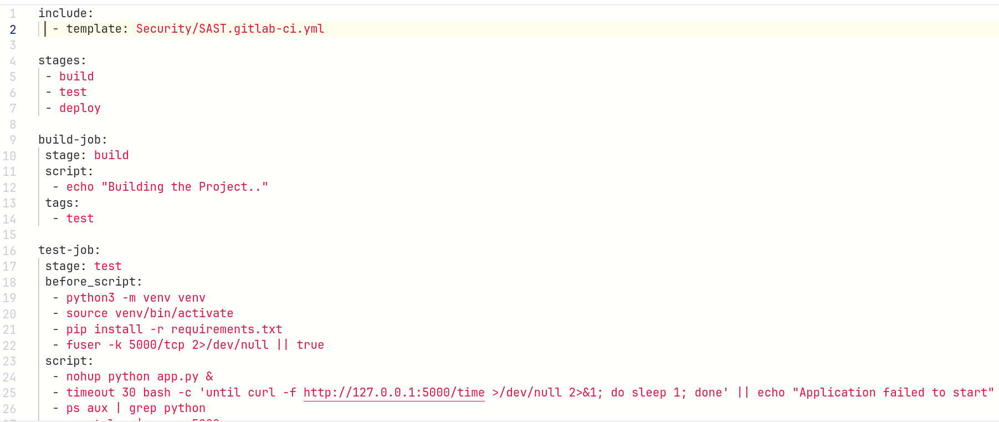
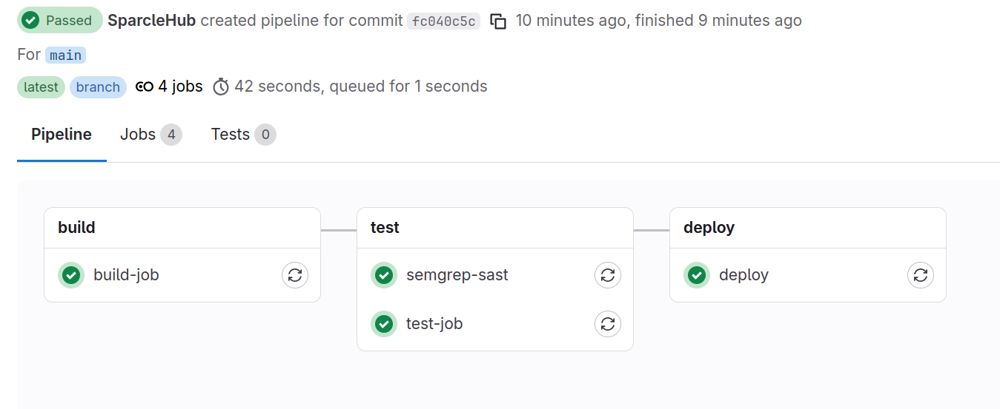
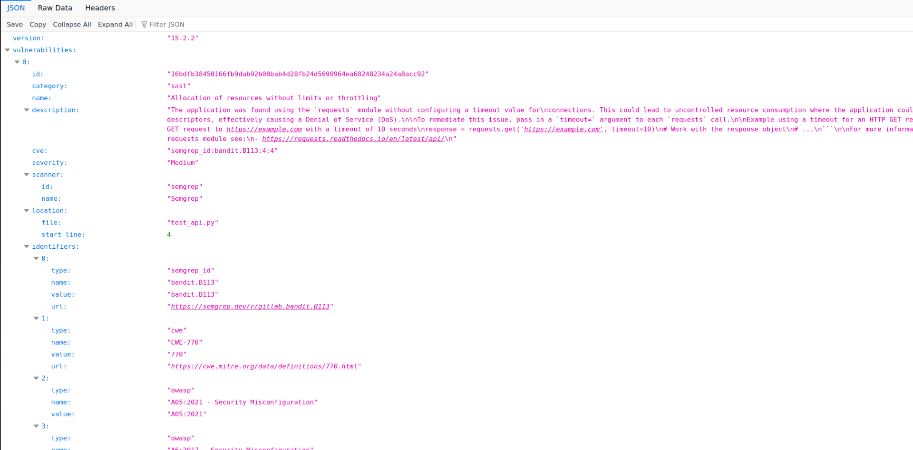
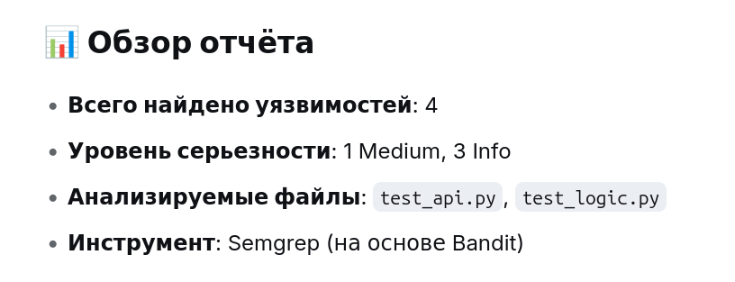
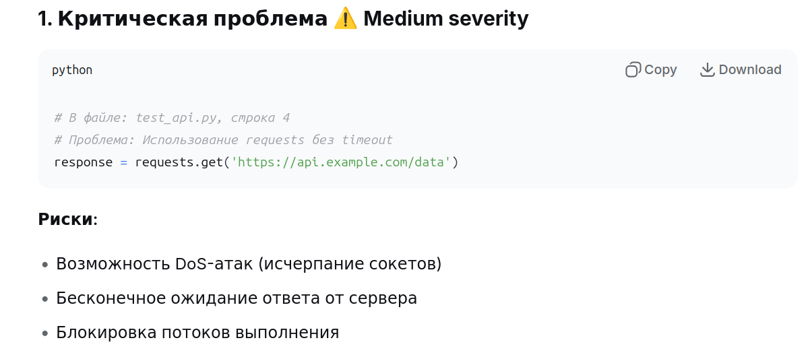
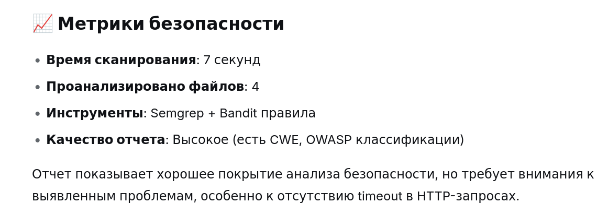

**Задание 1. Настраиваем SAST-сканирование в GitLab CI/CD**

1\. Включите SAST B.gitlab-ci.yml, используя шаблон GitLab.  

2\. Закоммитьте и запушьте изменения.  
3\. Запустите пайплайн и дождитесь выполнения SAST.  

4\. Перейдите в Build → Artifacts, найдите артефакты джоба SAST и скачайте gl-sast-report.json.  
  
 

5\. Проанализируйте отчет.  
  
  

Конечный результат: Автоматическое SAST-сканирование кода при каждом коммите, отчет с уязвимостями доступен в разделе с артефактами.