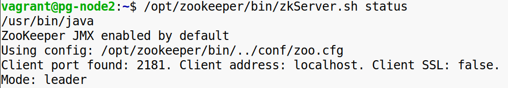
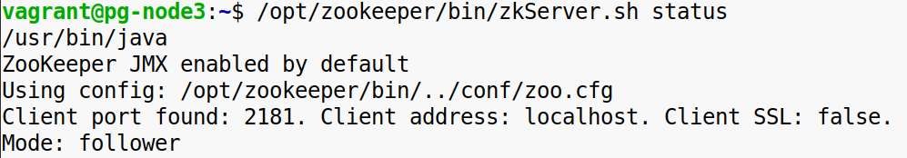
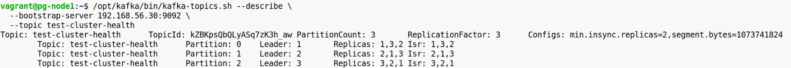
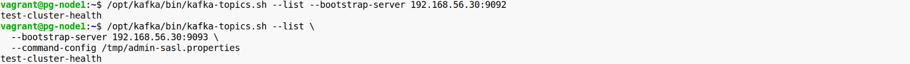
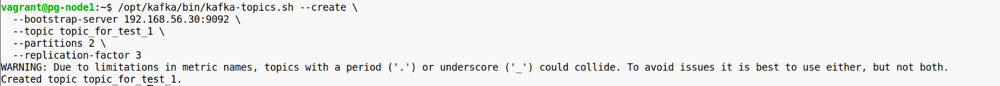
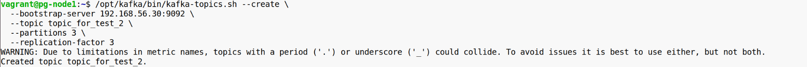
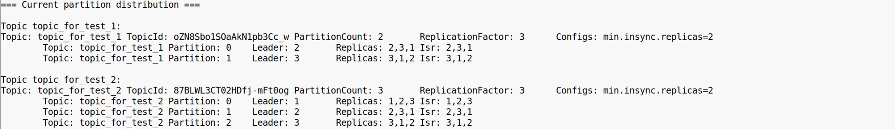
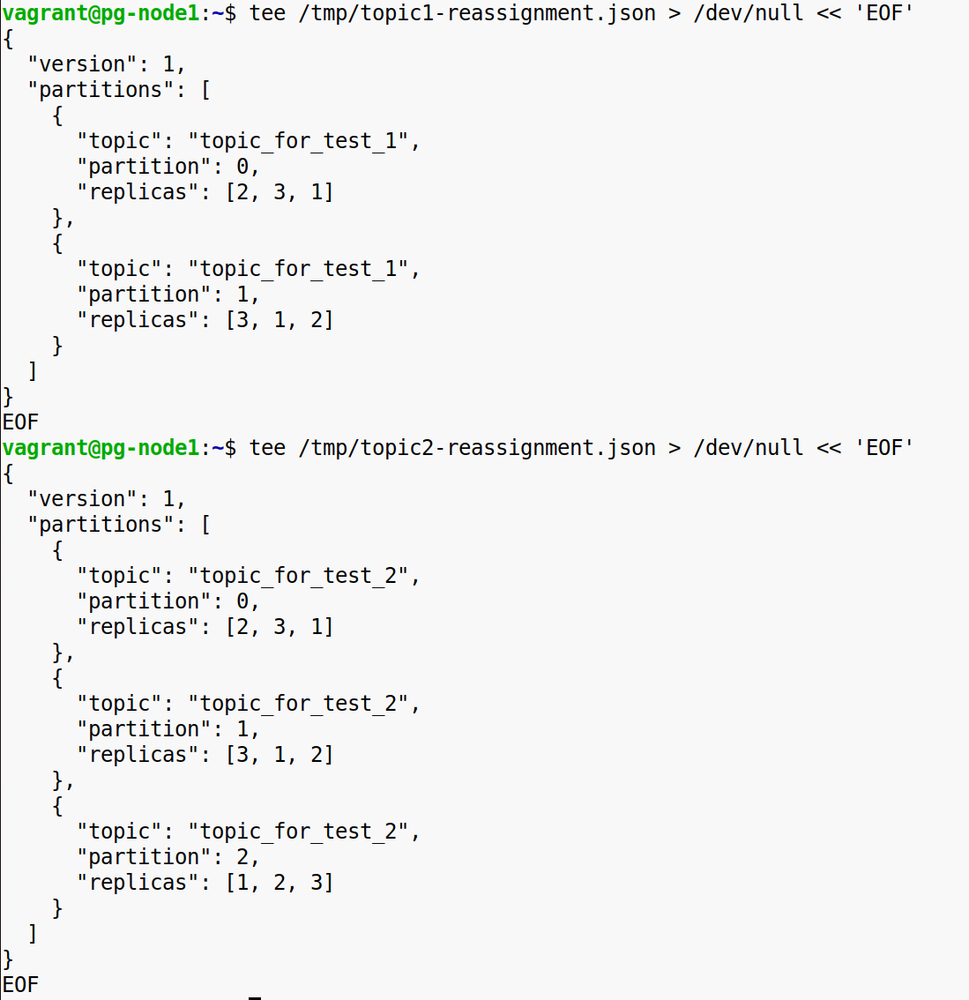
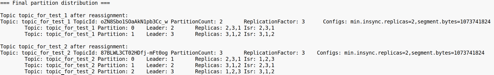

**Задание 1**

Установка и конфигурирование Kafka и Zookeeper.  
Вам нужно установить Kafka на свою машину или любую виртуальную и сконфигурировать её. Используйте tar архив или Докер. Нужно поднять кластер кафки и зукипера по 3 инстанса в каждом.

**Требования**

\-Скачать tar архив или docker image для запуска и конфигурирования kafka  
\-Скачать tar архив или docker image для запуска и конфигурирования zookeeper  
\-Создать конфиг файлы для Kafka и Zookeeper  
\-С помощью обычного докера или docker-compose поднимите кластер Zookeeper из трёх нод  
\-С помощью обычного докера или docker-compose поднимите кластер Kafka из трёх нод  
Kafka и Zookeeper должны собраться как кластера  
\-Проверить работоспособность кластеров и убедиться что в каждом из них по 3 ноды

* * *

  
  
  
  
 

\-Сконфигурировать для Kafka 2 порта, один должен быть без авторизации, а другой с авторизацией через SASL_PLAINTEXT

* * *

**Задание 2**

Создание топиков с разным количеством партиций и работа с ними

**Требования**

\-Создать топик topic_for_test_1 с 2 партициями

* * *

\-Создать топик topic_for_test_2 с 3 партициями

* * *

  
 \-Создать планы перераспределения партиций топиков между нодами, нужно что бы партиции переехали на другие ноды с тех на которых уже были, в этом пункте оба топика не зависят друг от друга

* * *

\-Перераспределить партиции по нодам

* * *

