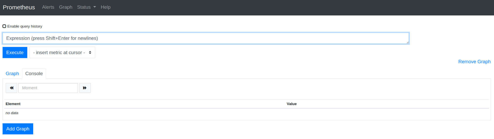

**Задание 1**

Установка Prometheus

**Требования**

\-Скачайте последнюю версию Prometheus.  
\-Распакуйте архив и поместите содержимое в рабочую директорию.  
\-Откройте файл prometheus.yml (это конфигурационный файл Prometheus) и убедитесь, что там уже настроен источник метрик (по умолчанию Prometheus сам собирает свои метрики).  
 

\-Запустите Prometheus командой ./prometheus.  
\-Откройте браузер и перейдите по адресу *http://localhost:&lt;номер_порта_указанный_в_файле&gt;*, чтобы проверить, что Prometheus работает.  

**Задание 2**

Установка Grafana

**Требования**

\-Скачайте Grafana.  
\-Установите её, следуя инструкциям для вашей операционной системы.  
\-После установки перейдите по адресу http://localhost:3000 и проверьте работоспособность.

****

&nbsp;

**Задание 3**

Установка Loki

**Требования**

\-Скачайте Loki с официального сайта.  
\-Установите и запустите его.  
\-Создайте конфигурационный файл с базовыми настройками и проверьте работоспособность.

****

&nbsp;

**Задание 4**

Создание простого дашборда в Grafana

**Требования**

1\. Подключите Prometheus как источник данных:  
\-В разделе "Data Sources" добавьте новый источник данных Prometheus.  
\-Укажите адрес Prometheus (http://localhost:9090) и сохраните настройки.

2\. Создайте новый дашборд:

\-Перейдите в раздел "Dashboards" и выберите "New Dashboard".  
\-Добавьте панель для визуализации метрики node_cpu_seconds_total.  
\-Настройте параметры отображения (цвет, подписи, заголовок).  

3\. Подключите Loki как источник данных:

\-В разделе "Data Sources" добавьте новый источник данных Loki.  
\-Укажите адрес Loki (http://localhost:3100) и сохраните настройки.  
\-Добавьте панель для логов:  
\-На том же дашборде добавьте новую панель, выбрав источник данных Loki.  
\-Настройте запрос для отображения всех логов или примените базовый фильтр, например, {job="grafana"}.

4\. Сохраните дашборд:

\-Задайте ему имя, например, "Базовый дашборд".  
  
 