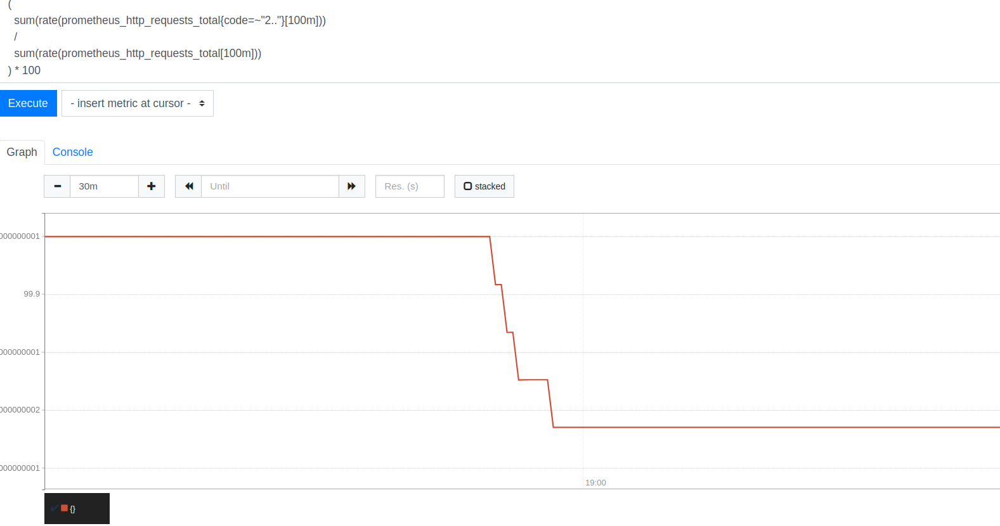

**Задание 1**

Изучение метрик с помощью Prometheus

**Требования**

1\. Установите node-exporter  
\-Убедитесь, что установлен node-exporter для сбора метрик вашего компьютера.  
\-Запустите Prometheus и node-exporter, убедитесь, что они работают.  
\-Настройте файл prometheus.yml, добавив задачу для node-exporter.  
\-Перезапустите Prometheus и убедитесь, что node-exporter отображается на странице Status → Targets.  
   
 2\. Исследуйте метрики

\-Перейдите на вкладку Graph в веб-интерфейсе Prometheus.  
\-Найдите и выполните запрос для отображения всех метрик, предоставляемых node-exporter.  
 

**Задание 2**

Работа с базовыми метриками

**Требования**

1\. Работа с базовыми метриками

\-Выполните запрос, который покажет количество доступной памяти.  
\-Постройте график для анализа изменения памяти во времени.  
   
 

2\. Рассчитайте среднюю загрузку процессора

\-Выполните запрос для вычисления средней загрузки процессора за последние 5 минут.  
\-Проанализируйте полученные результаты.

****

&nbsp;

**Задание 3**

Анализ дисков и нагрузки

**Требования**

1\. Определите самый загруженный диск

\-Напишите запрос, который покажет, какой диск был занят больше всего времени за последний час.  
\-Постройте график, чтобы визуализировать результаты.  
 

2\. Проанализируйте нагрузку на диски

\-Выполните запрос, чтобы узнать общее время ввода-вывода для всех дисков за последние 10 минут.  
 

&nbsp;

**Задание 4**

Работа с HTTP-запросами  
 **Требования**  
 1\. Определите общее количество HTTP-запросов  
 

2\. Проанализируйте скорость изменений HTTP-запросов

\- Постройте график изменения количества запросов за последние 10 минут.

&nbsp;

**Задание 5**

Создание алерта на высокую загрузку CPU

**Требования**

1\. Настройте Alertmanager  
\-Убедитесь, что Alertmanager установлен и добавлен в конфигурацию Prometheus.  
\-Добавьте алертинг при превышении порога загрузки цп 80%.  
   
 

2\. Создайте симуляцию нагрузки на процессор при помощи утилиты в Linux и убедитесь, что Alertmanager отправит уведомление.

  

**Задание 6**

Анализ доли успешных HTTP-запросов

**Требования**

1\. Определите процент успешных запросов среди всех HTTP-запросов за последние 10 минут.  

2\. Визуализируйте данные

\-Постройте график, чтобы увидеть изменения доли успешных запросов во времени.  

3\. Проанализируйте ошибки

\-Напишите отдельный запрос, чтобы определить долю запросов с ошибками.  

\-Сравните доли успешных запросов и запросов с ошибками, чтобы понять, как меняется стабильность работы веб- сервера.  
  
