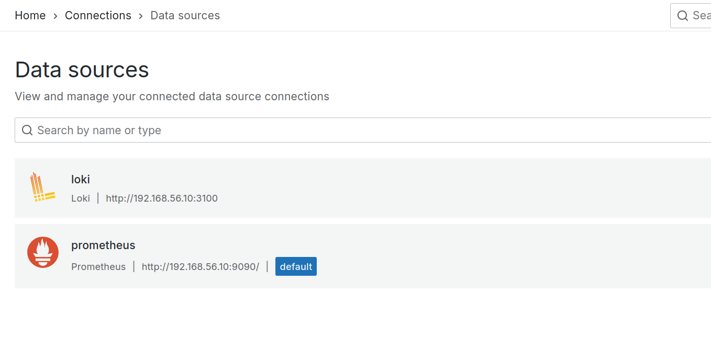
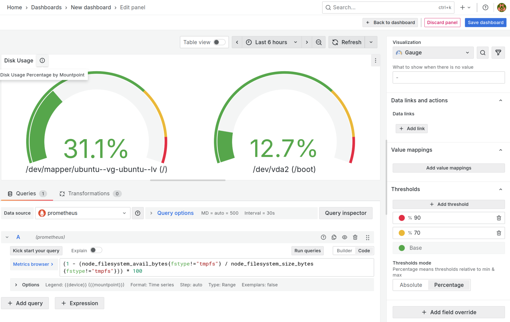
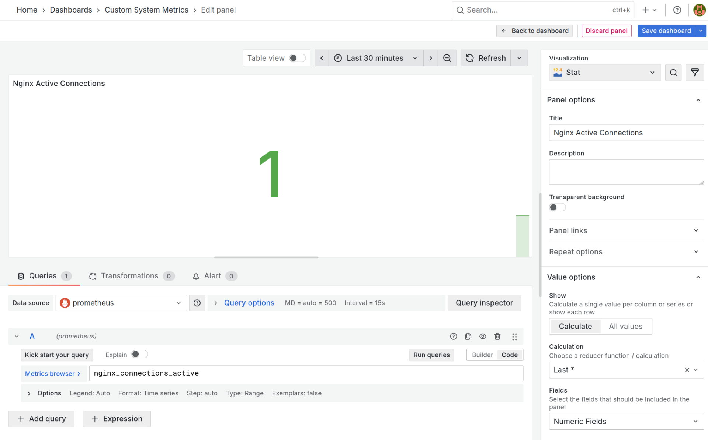

**Задание 1**

Анализ использования дискового пространства

**Требования**

1\. Подготовьте среду  
Убедитесь, что Grafana установлена и запущена на вашем компьютере или сервере.  
Убедитесь, что Prometheus настроен как источник данных и собирает метрики с node-exporter.  

2\. Создайте дашборд

Перейдите в Grafana и создайте новый дашборд.  
Добавьте новую панель с графическим отображением данных.

3\. Настройте панель

Добавьте график, отображающий процент использования диска.  
Настройте график так, чтобы он отображал отдельные значения для каждого диска на сервере.

4\. Настройте визуализацию

Установите пороговые значения (например, зелёный < 70%, жёлтый < 90%, красный ≥ 90%).  
Подпишите оси, заголовок и добавьте пояснение для графика.  
   
 

**Задание 2**

Мониторинг сетевой активности

**Требования**

1\. Подготовьте среду  
 Убедитесь, что node-exporter собирает метрики сетевой активности.  
2\. Создайте панель  
 Настройте график, отображающий входящий и исходящий трафик для сетевых интерфейсов.  
Убедитесь, что график отображает данные для всех активных интерфейсов.  
3\. Настройте визуализацию  
 Используйте области для отображения входящего и исходящего трафика.  
Добавьте легенду для каждой линии, указывающую, какой интерфейс она отображает.

&nbsp;

**Задание 3**

Отслеживание количества активных процессов

**Требования**

1\. Подготовьте панель

Добавьте график, отображающий общее количество активных процессов на сервере.

2\. Добавьте предупреждения

Настройте алерт, срабатывающий, если количество активных процессов превышает заданное значение (например, 500).

3\. Настройте уведомления

Настройте уведомления через email или другой канал связи.  
Проверьте, что уведомление срабатывает при превышении порога.  
Уведомления можно получать также через Telegram-бота, для этого необходимо его создать и получить токен.  
  
 

&nbsp;

&nbsp;

**Задание 4**

Мониторинг температуры оборудования

**Требования**

1\. Настройка экспортёра

Настройте node-exporter или другой экспортёр, который собирает данные о температуре оборудования (например, CPU или жёстких дисков).  

2\. Создайте график

Добавьте график, отображающий температуру CPU.

3\. Настройте визуализацию

Установите пороги: нормальная температура (&lt; 70°C), высокая (&gt; 70°C).  
Настройте цветовую градацию в зависимости от уровня температуры.

&nbsp;

**Задание 5**

Мониторинг состояния сервисов

**Требования**

1\. Подключите источник данных

Настройте Prometheus для сбора метрик состояния сервисов (например, Apache или MySQL).

2\. Создайте панель

Настройте график или индикатор, отображающий состояние сервиса, например, для MySQL можно использовать метрику количества активных соединений.  

2\. Настройте предупреждения

Настройте алерт, срабатывающий при достижении порогового значения (например, > 200 соединений).  
Проверьте отправку уведомлений через Telegram или Email.  
 

&nbsp;

&nbsp;

**Задание 6**

Анализ времени отклика HTTP-запросов

**Требования**

1\. Подключение экспортёра

Убедитесь, что Prometheus собирает метрики HTTP-запросов (например, с помощью Blackbox Exporter).

2\. Создание панели

Настройте график, отображающий среднее время отклика HTTP-запросов

3\. Настройка пороговых значений

Установите следующие пороговые значения: < 0.2 сек – нормальное состояние, 0.2–0.5 сек – предупреждение, 0.5 сек – критическая ситуация.

4\. Визуализируйте график  
