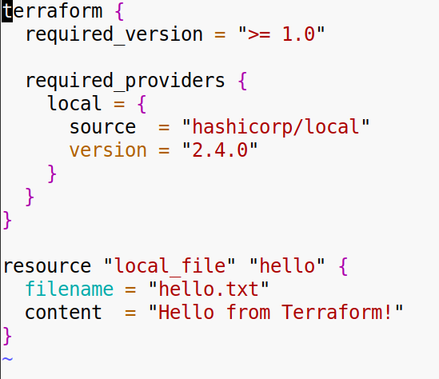
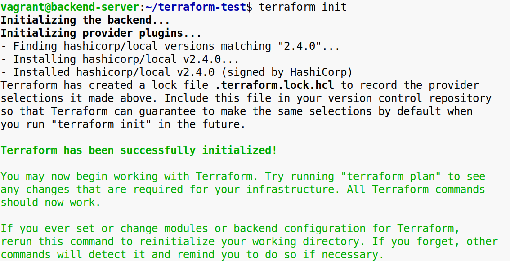
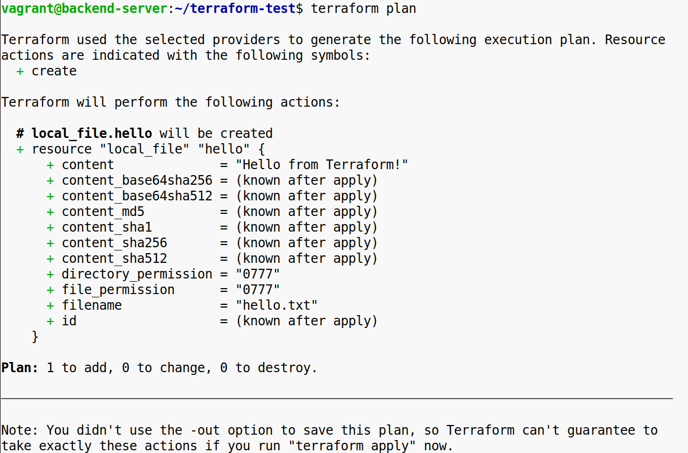
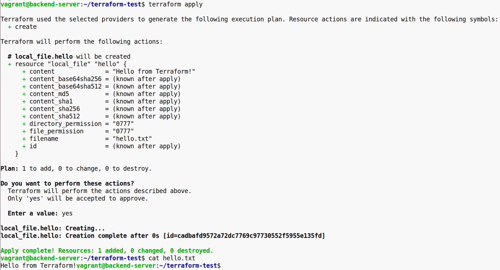
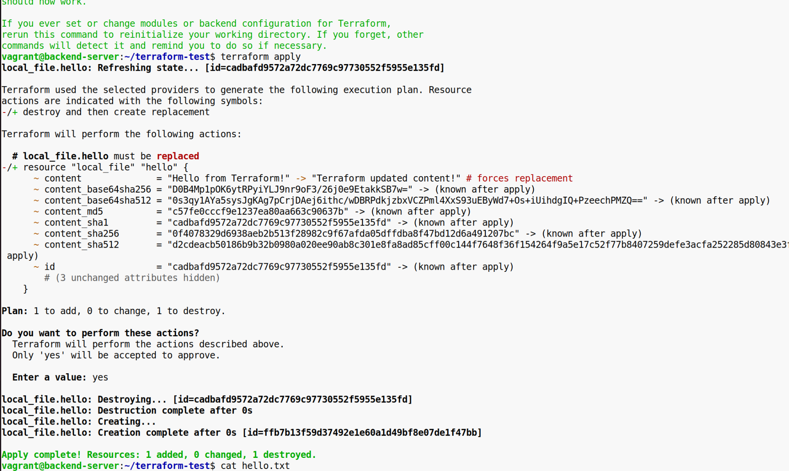
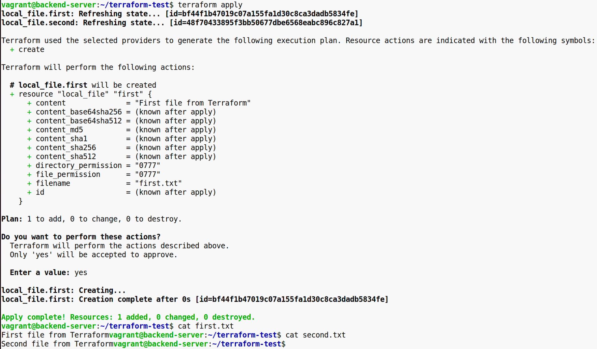

**Задание 1**:

1\. Напиши Terraform-конфигурацию, которая создаёт файл hello.txt. Используй local_file ресурс  
2\. В файл должно быть записано: Hello from Terraform!  

3\. Проинициализировать проект через terraform init, посмотреть вывод.

* * *

4\. Проверить и применить конфигурацию с помощью команд terraform plan, terraform apply и убедиться, что файл создан.

* * *

  
 5\. Измени текст в файле на Terraform updated content! и повторно примени изменения.  
6\. Применить terraform init  
   
 

**Задание 2**:

1\. В рамках одного конфигурационного файла опиши два ресурса local_file.  
2\. Первый должен создать файл first.txt с содержимым First file from Terraform.  
3\. Второй должен создать файл second.txt с содержимым Second file from Terraform.  
4\. Применить конфигурацию и убедиться, что оба файла созданы.  
 

5\. Отформатируй конфигурацию с помощью команды terraform fmt.  
