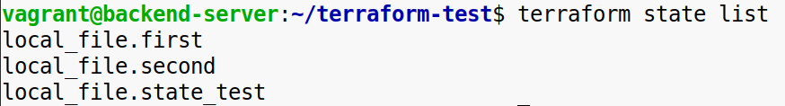
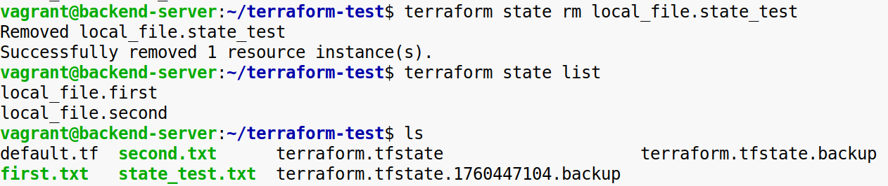
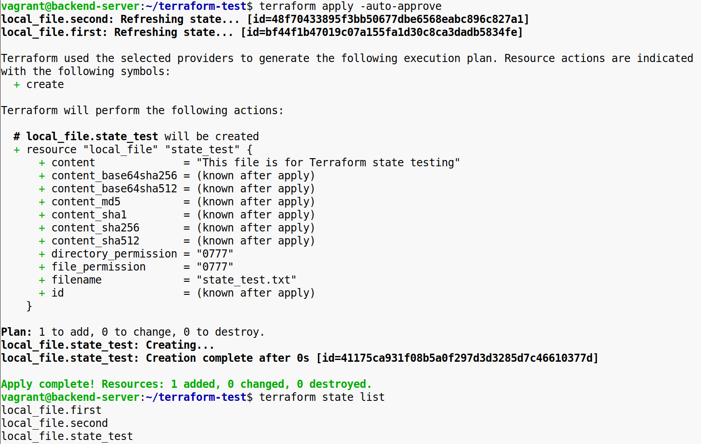

**Задание 1:**

Используя local_file, создай файл state_test.txt с любым содержимым.  
Убедись, что он отображается в списке ресурсов.  

Удали ресурс из terraform.tfstate, но не удаляй сам файл.  
Проверь, что файл остался на диске, но Terraform больше его не отслеживает.  
 

Импортируй файл обратно в стейт.  
 *ресурс local_file от провайдера hashicorp/local не поддерживает импорт  
*

&nbsp;

**Задание 2:**

Создай файл mv_example.txt через ресурс local_file.old_name.

Применить конфигурацию и убедиться, что файл создан.

Переименуй ресурс в конфигурации с old_name на new_name.

Выполни команду terraform state mv для обновления состояния без удаления файла.

Убедись, что файл остался нетронутым, а состояние соответствует новому имени.