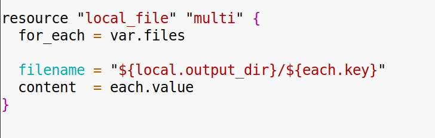

**Задание 1:**

1\. Опиши переменную filename и content.  

2\. Используй local для создания полного пути до файла.  
 

3\. Создай файл через local_file.  
 

4\. Верни путь к файлу в output.

****

&nbsp;

**Задание 2**:

1\. Используй переменную map с ключами — именами файлов, значениями — содержимым.  
   
  
 

2\. Через for_each создай файл на каждый элемент.

****

  
 

&nbsp;

**Задание 3:**

1\. Сформируй список строк, объединённый через join.  
   

2\. Преобразуй результат в верхний регистр и запиши в файл.  
 

3\. Верни содержимое в output.  
 

**  
 **

**Задание 4:**

1\. Прочитать подготовку для работы с Yandex Cloud.  
2\. Создать проект со структурой:

- provider.tf  
       
     
- variables.tf  
       
     
- main.tf  
       
    meta.txt:  
      
     
- terraform.tfvars  
       
     

3\. Получить токен для работы с сервисным аккаунтом облака.  
4\. C помощью провайдера yandex развернуть виртуальную машину с помощью ресурса yandex_compute_instance.  
5\. Настроить авторизацию для виртуальной машины по ssh c использованием cloud-init https://yandex.cloud/ru/docs/compute/operations/vm-create/create-with-cloud-init-scripts

6\. Авторизоваться на хосте по ssh ключу.  
  

7\. После выполнения задания удалить вм.  
 