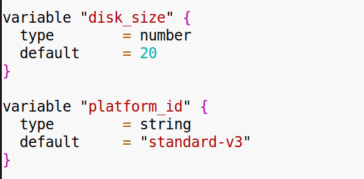
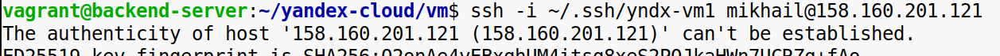
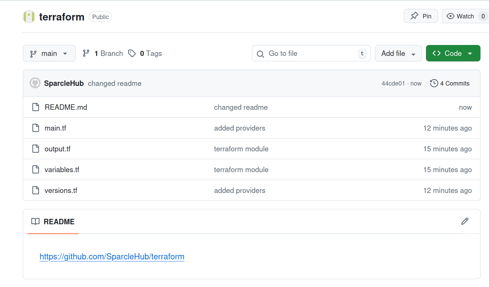

**Задание 1:**

На основе практического задания из предыдущей части требуется реализовать модуль для создания виртуальной машины.  
Модуль должен принимать в качестве переменных:

- Название вм
- Ресурсы (цпу, память, диск)
- Сетевые настройки
- Настройки для авторизации пользователей

1\. Реализовать модуль vm_module с указанными вводными.  
   
 main.tf  
  
 meta.txt  
  
 output.tf  
  
 provider.tf  
  
 variables.tf  
  
 modules/main.tf  
  
 modules/output.tf  
  
 modules/variables.tf  
  
  
 modules/versions.tf  
  
  

2\. Создать в проекте 2 виртуальные машины с помощью модуля.  
   
  
    
  
 

3\. Внести изменение в модуль (захардкодить значение цпу или памяти), применить изменную конфигурацию, посмотреть на вывод терраформа.  
   
  
  
 

4\. Удалить вм, вынести модуль в отдельный гит репозиторий, в исходном проекте поменять источник модуля на репозиторий. Применить конфигурацию заново.  
  
 main.tf  
  
   
   
 

5\. После окончания работы, удалить вм.