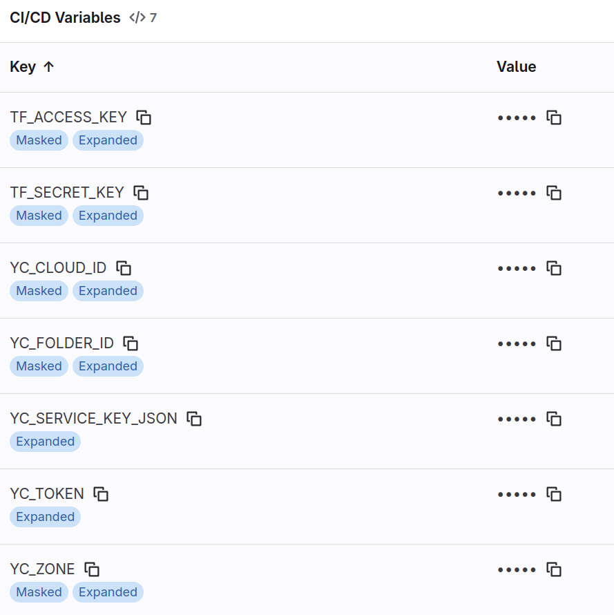
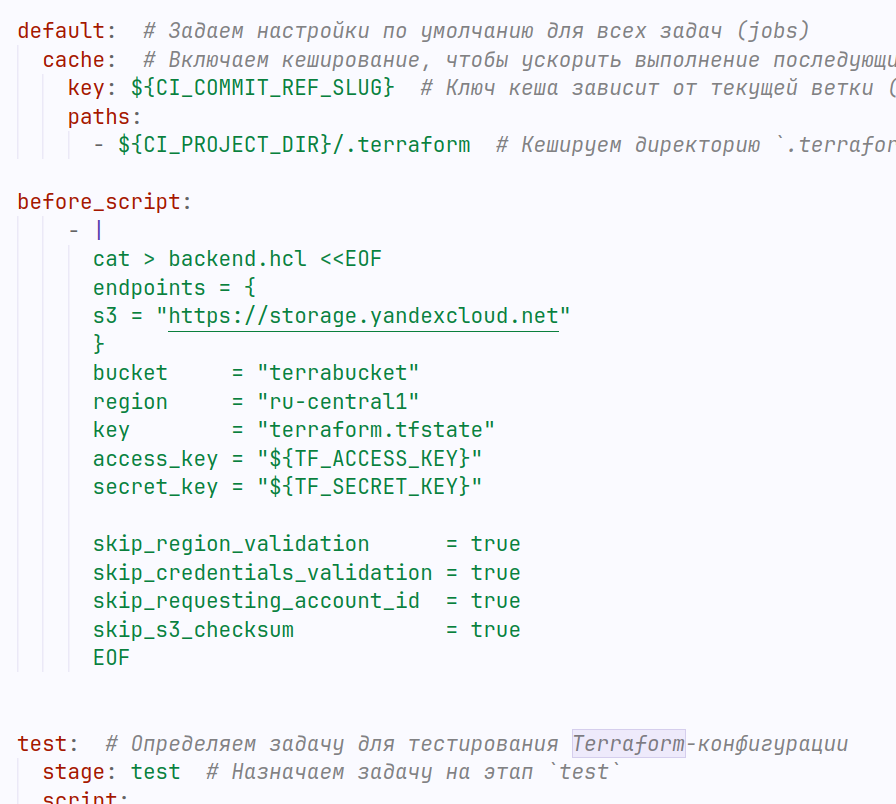
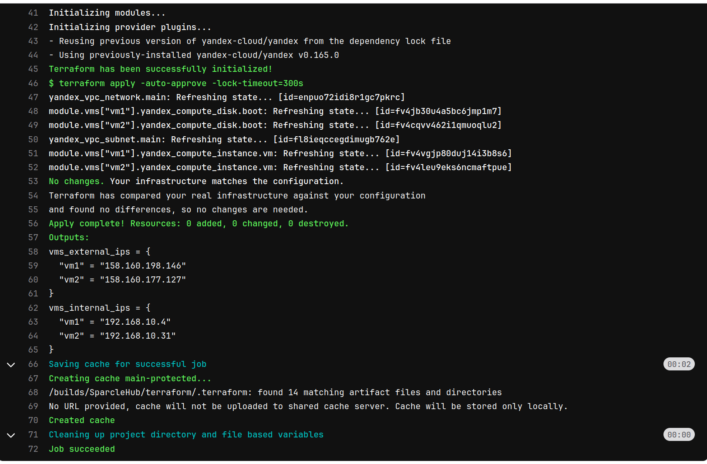
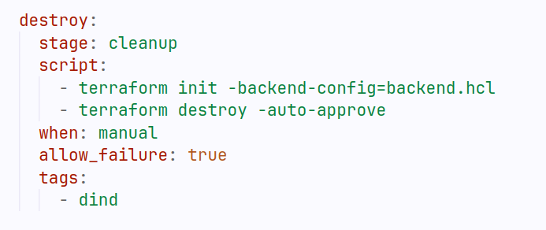
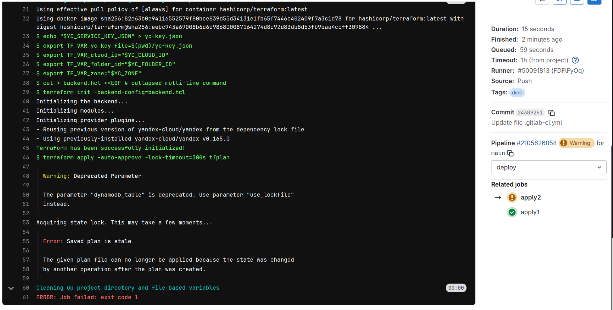
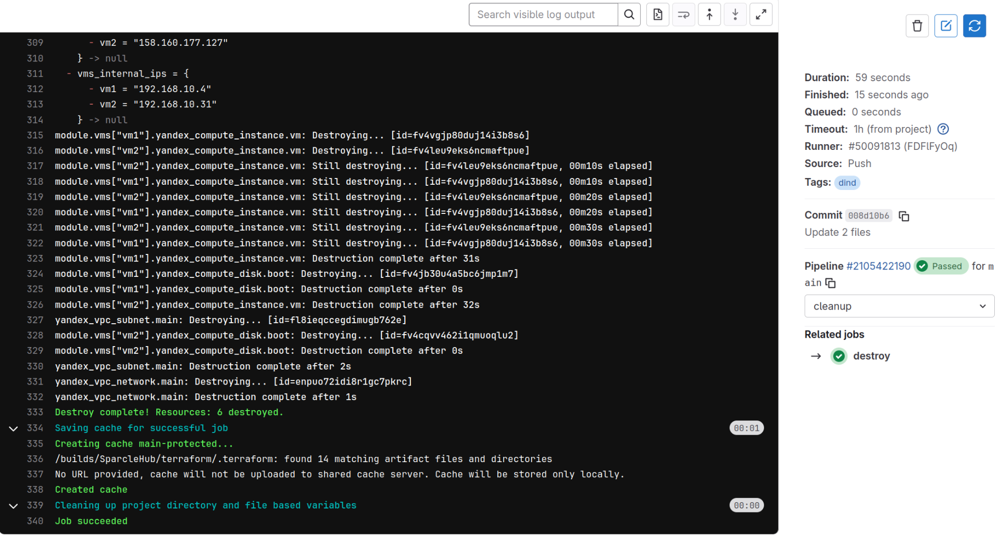

**Задание 1**

На основе предыдущей практики доработать приведенный в теме Gitlab CI для работы с деплоем виртуальных машин в Yandex Cloud:

1\. Вынести секреты в секреты репозитория  

2\. Использовать переменные окружения, которые задаются через переменные Gitlab Ci  
3\. Настроить remote backend вместо локального хранения terraform state  
  
  
 

4\. Добавить задание на удаление ресурсов.  
  
 

5\. Попробовать одновременно запустить несколько apply из разных заданий, посмотреть на вывод.  

6\. После окончания работы удалить вм через созданное задание.  
