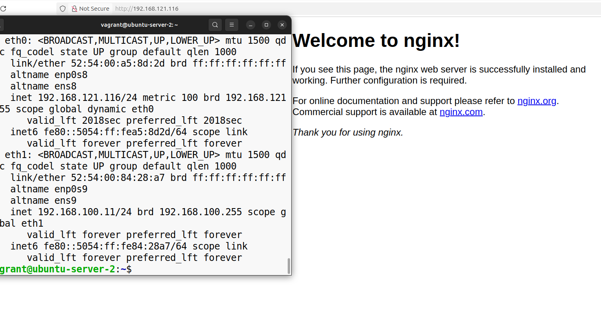
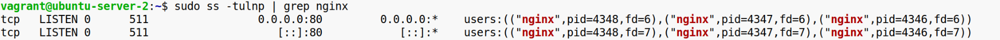
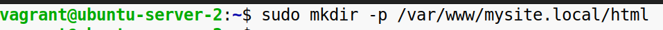
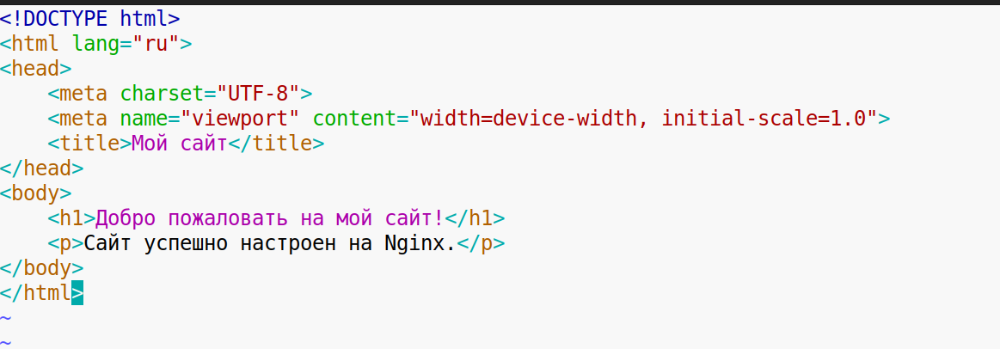
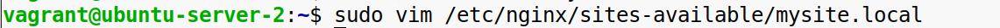
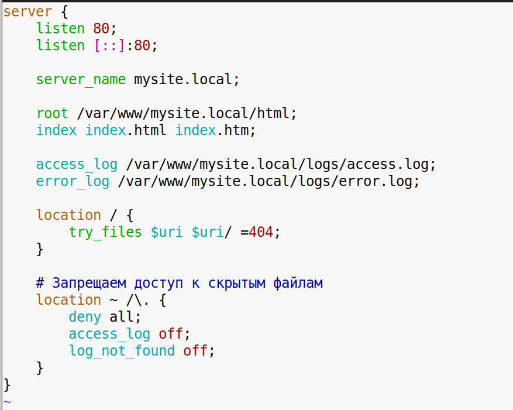
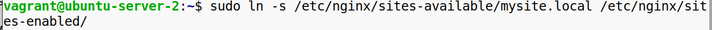
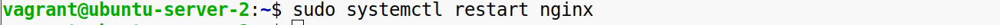
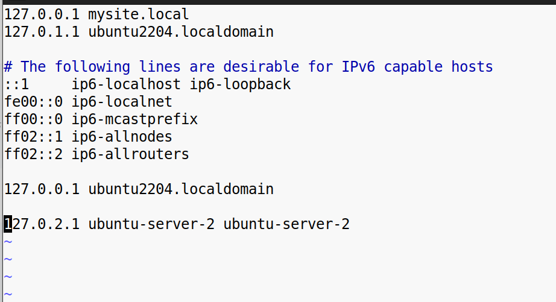
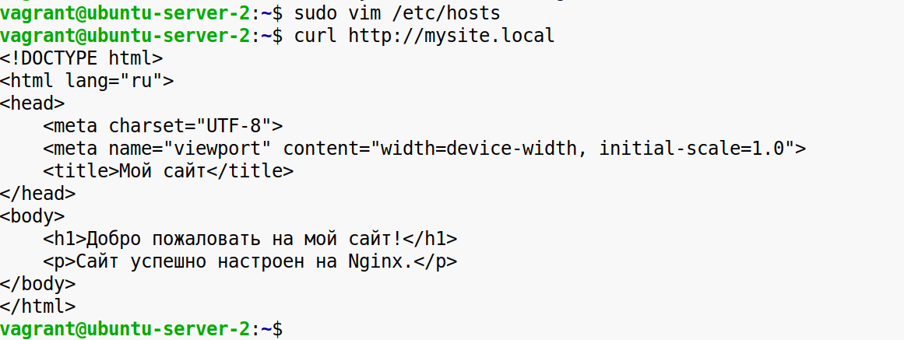

**Установка Nginx и базовая настройка статического сайта**

**Задание 1. Установите Nginx на вашем Linux-дистрибутиве (например, Ubuntu).** Можно использовать WSL или ВМ. Проверьте, что сервер успешно запущен, открыв браузер и перейдя по адресу http://localhost или выполнив curl-запрос. Вы должны увидеть стандартную страницу приветствия Nginx.  
  
  
 

**Задание 2. Настройте статический сайт:**

\-Создайте новую директорию для сайта.  

\-Добавьте в неё HTML-файл с простым содержимым, например, "Добро пожаловать на мой сайт!".  
   
  
 

\-Настройте конфигурацию Nginx так, чтобы сайт загружался при запросе http://mysite.local или другим доменным именем.  
   
  
  

\-Активируйте конфигурацию и перезапустите Nginx.  
  

\-Добавьте запись в файл hosts, чтобы доменное имя mysite.local соответствовало 127.0.0.1.  
  

**Конечный результат:** При переходе по адресу http://mysite.local в браузере или при выполнении curl-запроса должна отображаться ваша HTML-страница.