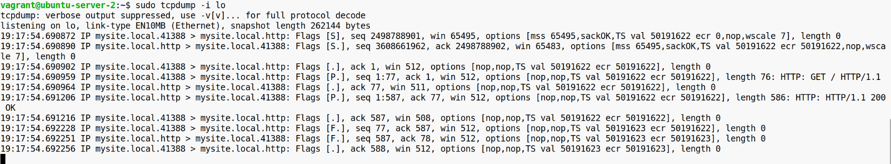
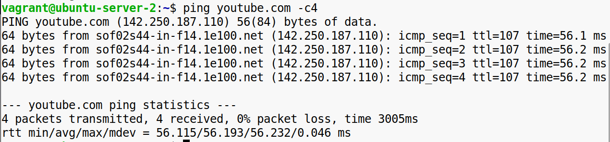
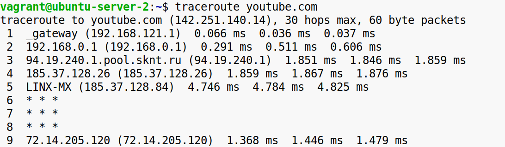

**Задание 1:**

**Анализ сетевых пакетов с помощью утилиты tcpdump**

\-Убедитесь, что утилита для анализа сетевого трафика (tcpdump) установлена в вашей системе. Если её нет, установите через пакетный менеджер.  
\-Запустите перехват сетевого трафика на одном из доступных интерфейсов.  
\-Сымитируйте сетевую активность (например, откройте веб-сайт, выполните ping-запрос).  
\-Проанализируйте, какие протоколы и данные передаются, сопоставьте их с уровнями модели OSI.  
  
mysite.local > mysite.local соответствует 3 уровню модели OSI  
Использование TCP, флагов и портов соответствует 4 уровню модели OSI  
HTTP-запросы и ответы соответствует 7 уровню модели OSI

**Конечный результат:** Понимание того, как перехватывать пакеты, определять протоколы и соотносить их с моделью OSI.

&nbsp;

**Задание 2:**

**Определение сетевой информации с помощью ір и ifconfig**

\-Проверьте доступность любого веб-ресурса или другого узла в сети с помощью утилиты ping.  

\-Определите маршрут до узла, используя traceroute.  

\- Сравните результаты работы этих утилит, выясните, как они работают на разных уровнях модели OSI.

Ping работает на 3 уровне модели OSI.  
Traceroute работает на 3 и 4 уровнях модели OSI.

**Конечный результат:** Умение диагностировать сетевые соединения и анализировать маршруты данных.