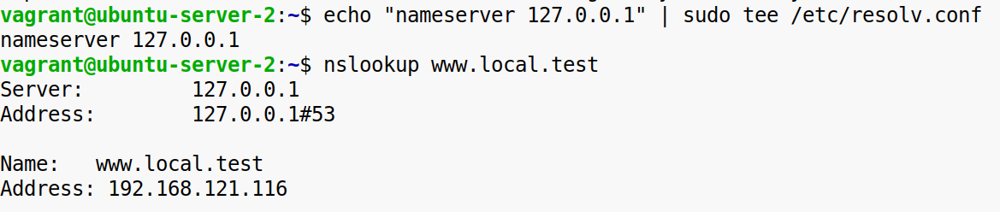

**Задание 1:**

**Настройка и анализ DNS-запросов**

1\. Установите утилиты для работы с DNS-запросами, например dnsutils (включает команды dig и nslookup).  
2\. Выполните анализ DNS-запросов:

\-Определите IP-адрес для домена (например, www.example.com).  

\-Найдите серверы имен (NS-записи) для домена.  

\-Проверьте почтовые серверы (MX-записи) для домена.  

\-Определите обратное разрешение (PTR-запись) для IP-адреса.  

**Конечный результат:** Должны быть получены корректные данные для всех типов записей.

&nbsp;

&nbsp;

**Задание 2:**

**Построение локального DNS-сервера**

1\. Установите сервер BIND (или альтернативное ПО для DNS).  
2\. Настройте локальную зону:

\-Определите домен (например, local.test) и настройте для него записи (A, CNAME и другие).  
  
  
 

\-Укажите зоны и их параметры в конфигурации DNS-сервера.  
  

3\. Перезапустите DNS-сервер.  
  
4\. Проверьте работу зоны, отправив DNS-запрос к локальному серверу.  
  
**Конечный результат:** Локальный домен (например, www.local.test) должен разрешаться в указанный IP-адрес.

&nbsp;

&nbsp;

&nbsp;

**Задание 3:**

**Работа с HTTP-запросами**

1\. Установите инструмент для работы с HTTP-запросами, например curl или Postman.  
2\. Выполните следующие запросы:

\-GET-запрос к публичному сайту.  

\-POST-запрос с тестовыми данными к API (например, тестовому API - https://jsonplaceholder.typicode.com/).  

\-PUT-запрос для обновления данных на том же API.  

\-DELETE-запрос для удаления данных.  

**Конечный результат:** Сервер должен возвращать успешные статусы (например, 200, 201, 204) в зависимости от типа запроса.

&nbsp;

&nbsp;

&nbsp;

**Задание 4:**

**Генерация и установка SSL-сертификата**

1\. Установите OpenSSL для создания сертификатов.  

2\. Сгенерируйте самоподписанный SSL-сертификат:

\-Укажите параметры сертификата (домен, организация, срок действия).  
\-Создайте закрытый ключ и публичный сертификат.  

3\. Настройте веб-сервер (например, Nginx) для использования сертификата.  
  

4.Откройте сайт в браузере или отправьте запрос с помощью curl.  

**Конечный результат:** Сайт доступен по HTTPS, при этом может отображаться предупреждение о ненадежном сертификате.

&nbsp;

&nbsp;

&nbsp;

**Задание 5:**

**Сравнение HTTP/1.1 и HTTP/2**

1\. Убедитесь, что веб-сервер поддерживает HTTP/2 (например, проверьте конфигурацию Nginx).  
2\. Настройте сервер для работы с HTTP/2.  

3\. Создайте страницу с несколькими ресурсами (CSS, JS, изображения).  
index.html  
  
style.css  
  
script.js  
  
   
  

4\. Выполните запросы с использованием инструментов curl или браузерных DevTools, чтобы изучить разницу между HTTP/1.1 и HTTP/2.  
  
 

**Конечный результат:** Должны быть заметны различия в скорости обработки и загрузки ресурсов между HTTP/1.1 и HTTP/2.