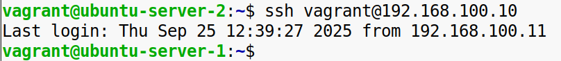
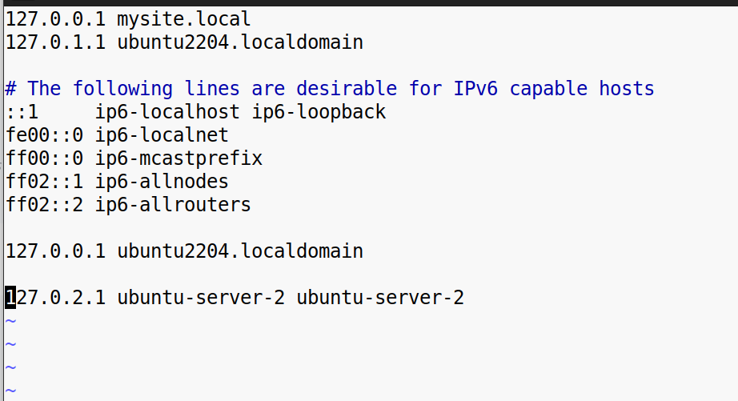
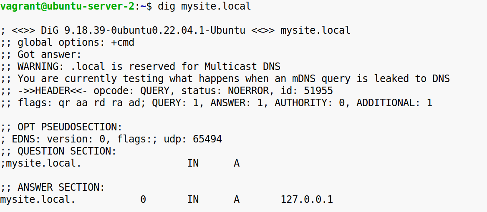
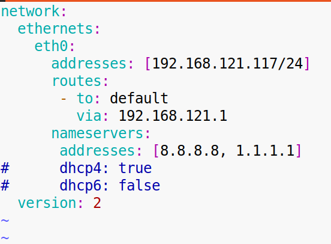
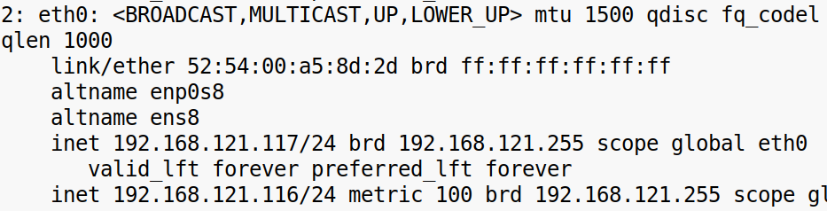

**Задание 1:**

**Настройка SSH и базовая работа с ключами**

**1\. Установка и настройка SSH-сервера:**

\-Установите SSH-сервер на вашем Linux-дистрибутиве (например, Ubuntu) в WSL или виртуальной машине.  
\-Убедитесь, что служба SSH запущена, и проверьте возможность подключения к серверу через SSH с локальной машины.

**2\. Генерация и использование SSH-ключей.**

\-Сгенерируйте пару SSH-ключей на клиентской машине.  
\-Добавьте публичный ключ в файл authorized_keys на сервере для обеспечения аутентификации по ключу.  
\-Подключитесь к серверу с использованием сгенерированного ключа, убедившись, что аутентификация проходит без запроса пароля.  

**Конечный результат:** Успешное подключение к серверу через SSH с использованием ключевой аутентификации.

&nbsp;

**Задание 2:**

**Настройка и использование конфигурационных файлов сети в Ubuntu**

**1\. Редактирование файла /etc/hosts:**

\-Откройте файл /etc/hosts с правами суперпользователя.  
\-Добавьте строку, связывающую желаемое доменное имя с соответствующим ІР-адресом.  
\-Сохраните изменения и закройте файл.  
\-Проверьте, что при обращении к указанному доменному имени система использует заданный IP-адрес.  
  

**2\. Настройка сетевых интерфейсов:**

\-Определите, какая система управления сетевыми интерфейсами используется в вашей версии Ubuntu:  
\-Для Ubuntu 17.10 и новее применяется Netplan.  
\-Для более ранних версий используется файл /etc/network/interfaces.

**\-Для Ubuntu 17.10 и новее (Netplan)**:

\-Откройте соответствующий YAML-файл конфигурации в каталоге /etc/netplan/.  
\-Добавьте или измените настройки для нужного сетевого интерфейса, указав статический IP-адрес, маску подсети, шлюз и DNS-серверы.  
  
\-Сохраните изменения и примените новую конфигурацию с помощью команды netplan apply.  
\-Проверьте, что интерфейс получил указанный IP-адрес.  

**Конечный результат:** Вы освоите работу с основными конфигурационными файлами сети в Ubuntu и поймете их влияние на сетевые настройки системы.

&nbsp;

&nbsp;

&nbsp;

&nbsp;

&nbsp;