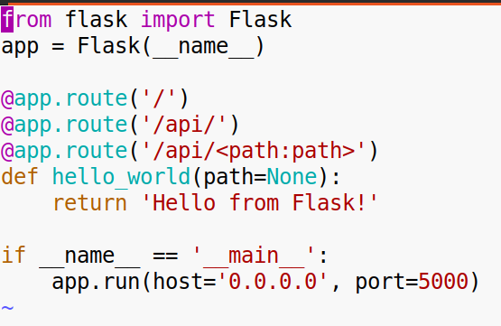
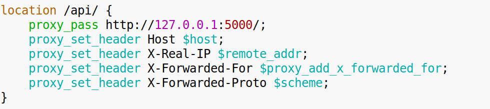
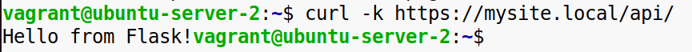
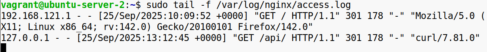
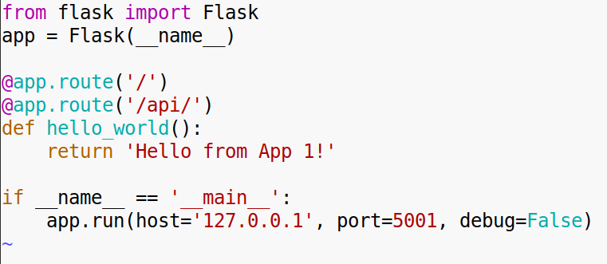
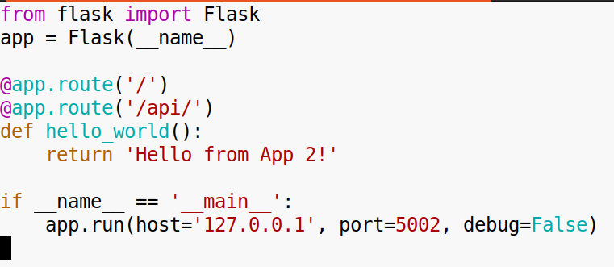
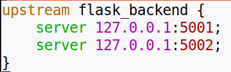
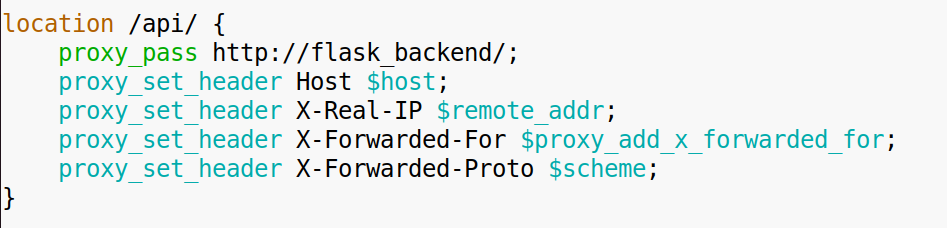
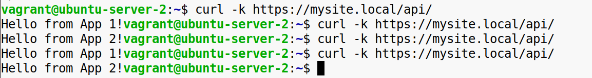
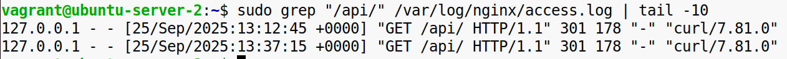

**Задание 1:**

**Настройка обратного прокси**

1\. Установите Python и Flask. Создайте простое Flask-приложение, которое будет запускаться на порту 5000. Оно должно возвращать текст, например, "Hello from Flask!".  
  
  
 

2\. Настройте Nginx для проксирования запросов:  
\-Настройте так, чтобы запросы к http://mysite.local/api/ перенаправлялись на ваше Flask-приложение.  

3\. Перезапустите Flask-приложение и Nginx. Проверьте, что запросы к [http://mysite.local/api/возвращают](http://mysite.local/api/%D0%B2%D0%BE%D0%B7%D0%B2%D1%80%D0%B0%D1%89%D0%B0%D1%8E%D1%82) ответ от вашего Flask-приложения.  
  

**Конечный результат:** При переходе по адресу http://mysite.local/api/ в браузере вы должны видеть сообщение из вашего Flask-приложения. Убедитесь, что ответ от приложения появляется, и проверьте логи Nginx для подтверждения, что запросы проксируются.

&nbsp;

**Задание 2:**

**Балансировка нагрузки**

1\. Создайте два Flask-приложения на портах 5001 и 5002. Каждое должно возвращать уникальный текст, например, "Hello from App 1!" и "Hello from App 2!".  
 sudo vim /opt/flask_app1.py  
  
sudo vim /opt/flask_app2.py  
  
 

2\. Настройте Nginx для балансировки нагрузки:

\-Настройте upstream-блок, который включает оба Flask-приложения.  

\-Настройте проксирование всех запросов к http://mysite.local/ на этот upstream-блок.  

3\. Перезапустите приложения и Nginx. Проверьте, что запросы распределяются между двумя приложениями.  
  

**Конечный результат:** При обновлении страницы на http://mysite.local в браузере вы должны видеть чередующиеся ответы от двух Flask-приложений. Обновите страницу несколько раз и убедитесь, что ответы от приложений чередуются. Проверьте логи Nginx для подтверждения распределения запросов.

&nbsp;

&nbsp;

&nbsp;