**Задание 1:**

**Введение в iptables и ufw**

\-Убедитесь, что на вашем Linux-дистрибутиве установлены iptables и ufw.  
\-Проверьте текущие правила фаервола, используя стандартные команды.  
\-Активируйте ufw и создайте базовое правило для разрешения подключения по SSH (порт 22).  
\-Перезагрузите фаервол и убедитесь, что правило работает, выполнив подключение через SSH.  
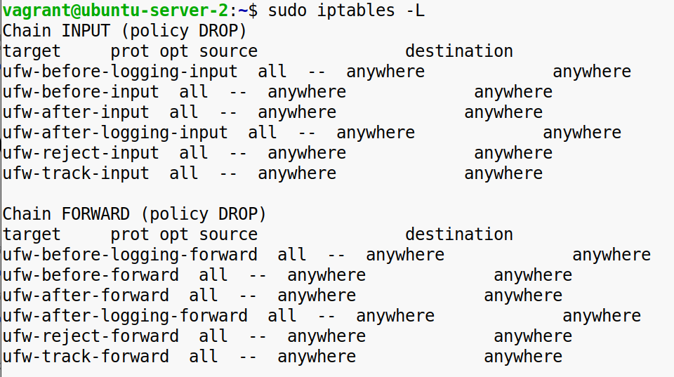  
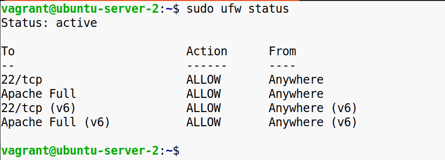  
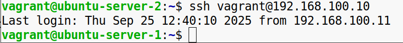

**Конечный результат**: Активированный фаервол с настроенным правилом для SSH.

&nbsp;

&nbsp;

**Задание 2:**

**Основные цепочки и таблицы в iptables**

\-Создайте новое правило в iptables для блокировки всех входящих подключений на определённый порт (например, порт 8080).  

\-Добавьте правило для разрешения подключений с конкретного IP-адреса (например, локального 127.0.0.1).  

\-Проверьте работу правил, используя команды тестирования соединений, такие как telnet или curl.  
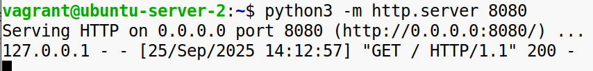  
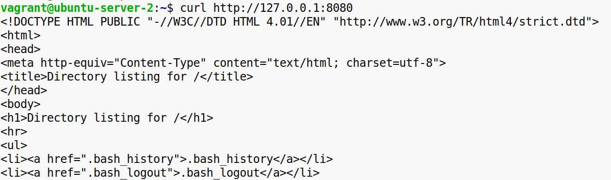  
 

**Конечный результат**: Рабочие правила iptables, ограничивающие доступ к порту.

&nbsp;

&nbsp;

**Задание 3:**

**Современные альтернативы: nftables**

\-Установите nftables (если он отсутствует).  
\-Настройте базовые правила, аналогичные тем, что были созданы в iptables, но с использованием nftables.  
\-Проверьте функциональность и убедитесь, что доступ работает по настроенным правилам.  
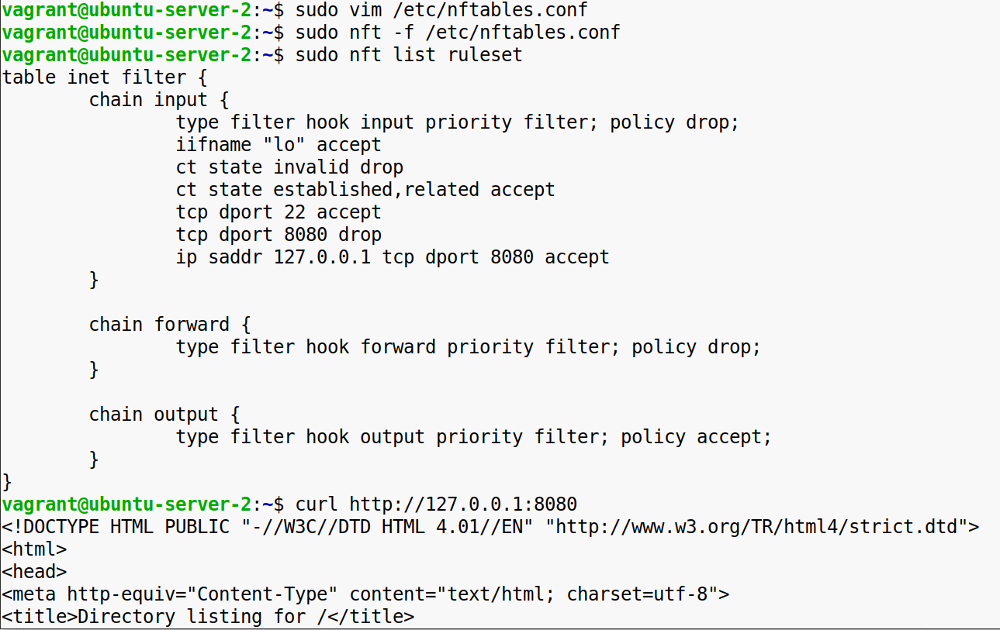

**Конечный результат**: Настроенный nftables с базовыми правилами безопасности.

&nbsp;

&nbsp;

**Задание 4:**

**Настройка WireGuard**

\-Установите WireGuard на вашем сервере и клиенте.  
\-Создайте ключи шифрования и настройте конфигурации для сервера и клиента.  
 Server  
/etc/wireguard/wg0.conf  
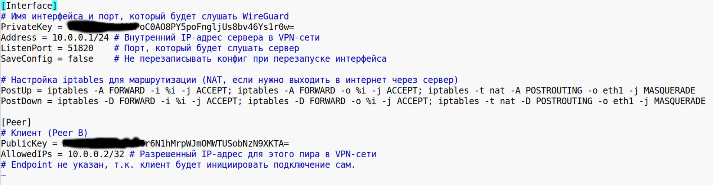

Client  
/etc/wireguard/wg0.conf  
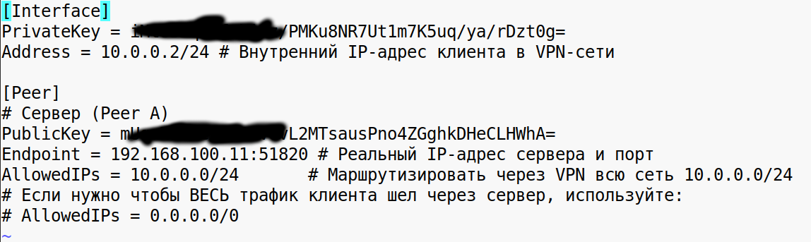  
 

\-Настройте сервер для работы через публичный IP-адрес и создайте частную сеть, подключив клиента.  
  
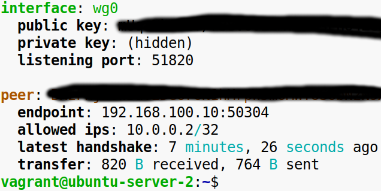  
\-Убедитесь, что клиент может пинговать сервер в приватной сети.  
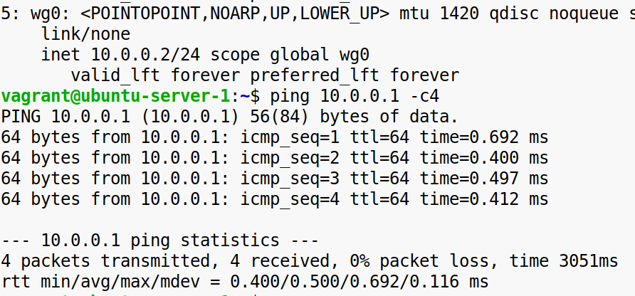

**Конечный результат**: Рабочая VPN-сеть на основе WireGuard, с пингом между клиентом и сервером.

&nbsp;

&nbsp;

**Задание 5:**

**OpenVPN: настройка и отличия**

\-Установите OpenVPN и создайте базовую конфигурацию для сервера.  
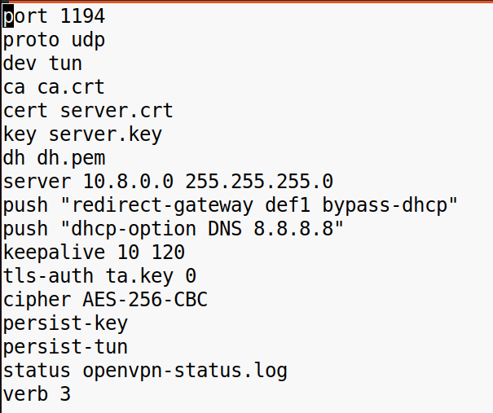

\-Настройте клиента для подключения к серверу.  
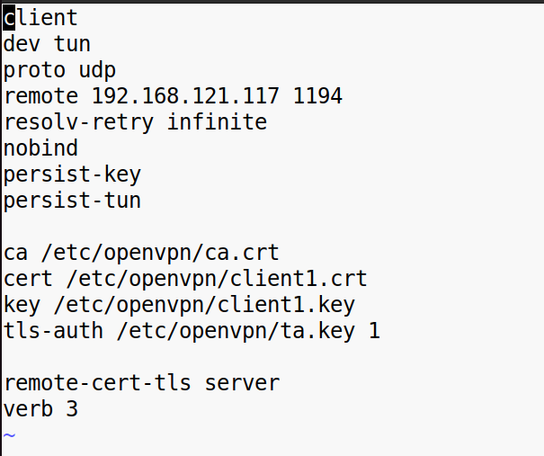

\-Проверьте, что трафик с клиента перенаправляется через VPN-сервер.  
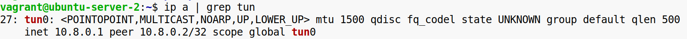  
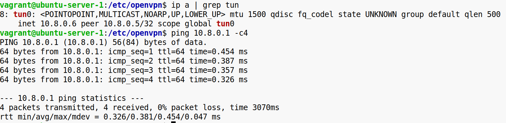

**Конечный результат**: Настроенный OpenVPN с проверкой маршрутизации трафика.