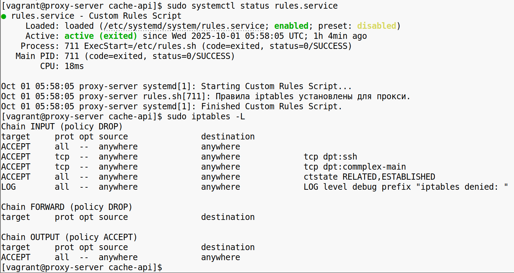
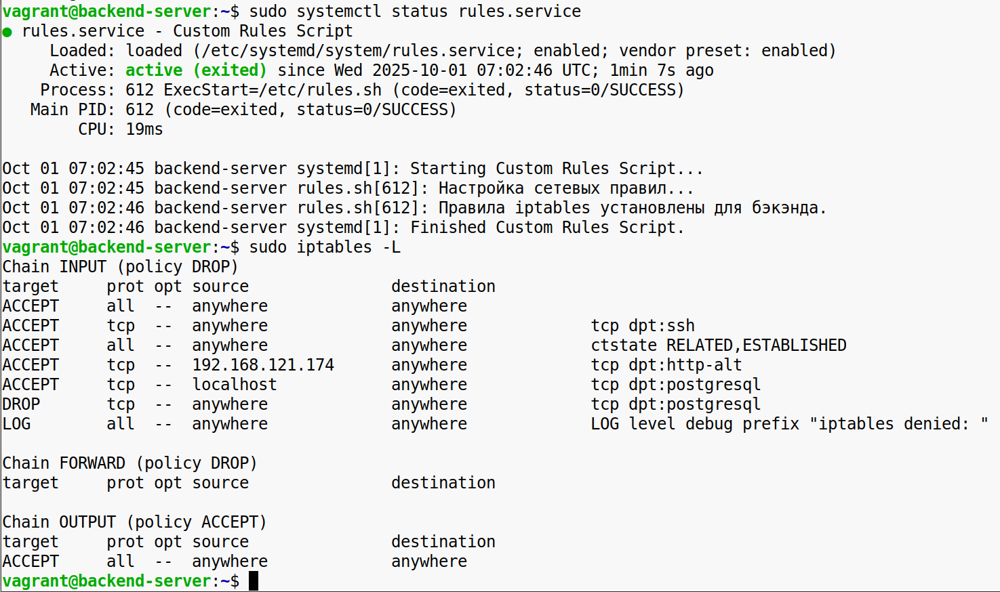
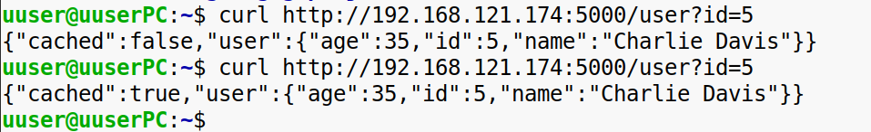
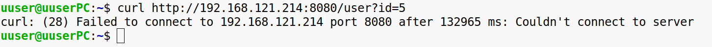
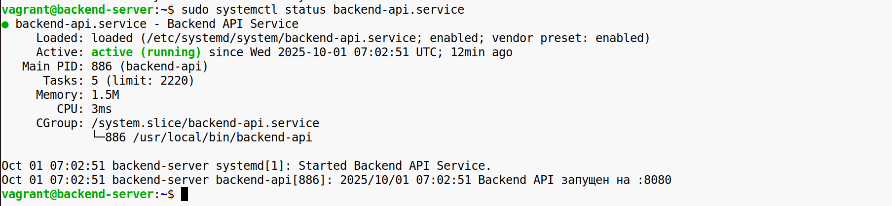
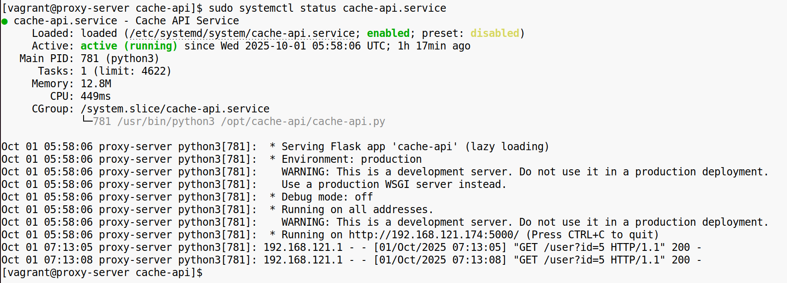

| Машина | IP  | OS  |
| --- | --- | --- |
| uuser@uuserPC - хост | 192.168.121.1 | Ubuntu Desktop 24.04 |
| vagrant@backend-server | 192.168.121.214 | Ubuntu Server 22.04 |
| vagrant@proxy-server | 192.168.121.174 | Rocky Linux 9.6 |

**Статус rules сервиса и настройки iptables на прокси**

* * *

**Статус rules сервиса и настройки iptables на бэкэнде**

* * *

**Curl-запрос с хоста на прокси**

* * *

**Запрос напрямую на сервер отклонён**

* * *

**Статус бэкэнд сервиса**

* * *

**Статус прокси сервиса**

* * *

